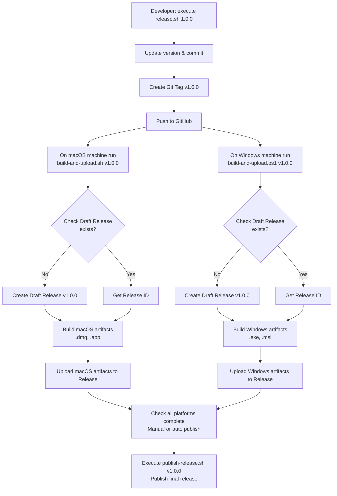

# Debugtron Tauri Decision Log

> Technical decision records and implementation details

This document records key technical decisions made during the development of Debugtron Tauri, including problem analysis, solution selection, implementation details, and rationale.

## Table of Contents

- [2025-11-26: State Synchronization Strategy](#2025-11-26-state-synchronization-strategy)
- [2025-11-26: Error Handling Strategy](#2025-11-26-error-handling-strategy)
- [2025-11-26: macOS ICNS Icon Extraction](#2025-11-26-macos-icns-icon-extraction)
- [2025-11-27: Event Timing Issue Resolution](#2025-11-27-event-timing-issue-resolution)
- [2025-11-27: Process I/O Management](#2025-11-27-process-io-management)
- [2025-11-27: Log Forwarding Architecture](#2025-11-27-log-forwarding-architecture)
- [2025-11-27: Xterm Log Display Performance Optimization](#2025-11-27-xterm-log-display-performance-optimization)
- [2025-11-27: DevTools Browser Opening Implementation](#2025-11-27-devtools-browser-opening-implementation)
- [2025-11-28: Dual-Mode DevTools Opening](#2025-11-28-dual-mode-devtools-opening)
- [2025-11-28: Progressive Polling Optimization](#2025-11-28-progressive-polling-optimization)
- [2025-11-28: Multi-Session Tab Synchronization and SessionId Consistency Fix](#2025-11-28-multi-session-tab-synchronization-and-sessionid-consistency-fix)
- [2025-11-28: Inspect-brk Debug Mode Implementation](#2025-11-28-inspect-brk-debug-mode-implementation)
- [2025-11-29: Multi-Platform Local Release Mechanism Design](#2025-11-29-multi-platform-local-release-mechanism-design)
- [2025-11-29: Windows Platform PE Resource Icon Extraction](#2025-11-29-windows-platform-pe-resource-icon-extraction)

---

## 2025-11-26: State Synchronization Strategy

**Problem**: Electron used `electron-redux` for automatic main/renderer process state synchronization. How to implement this in Tauri?

**Decision**: Use Tauri Events for manual synchronization
- Rust maintains single source of truth
- State changes sent via `app.emit_all()` events
- Frontend listens to events and dispatches Redux actions

**Reasoning**:
- Avoids bidirectional synchronization conflicts
- Clearer data flow
- Better performance control

**Related Implementation**: Event system architecture

## 2025-11-26: Error Handling Strategy

**Problem**: How to unify error types between Rust and TypeScript?

**Decision**: Use `anyhow::Error` + string passing
- Rust side uses `anyhow::Error` for all errors
- Tauri Command returns `Result<T, String>`
- Frontend receives error strings and displays them

**Reasoning**:
- Simple and direct
- Avoids complex error type serialization
- Follows Tauri best practices

## 2025-11-26: macOS ICNS Icon Extraction

**Problem**: How to extract icons from macOS `.icns` files in Rust?

**Decision**: Manual ICNS format parsing to extract PNG data
- Read ICNS file binary data
- Parse ICNS container format (magic number + size + entries)
- Find embedded PNG image data (check for PNG signature `89 50 4E 47`)
- Convert to Base64 data URI

**Implementation Details**:
```rust
// ICNS format: [magic:4 bytes][size:4 bytes][entries...]
// Entry format: [type:4 bytes][size:4 bytes][data:n bytes]
// Select largest PNG entry
```

**Reasoning**:
- Avoids dependency on complex image processing libraries
- Only needs to extract existing PNG data, no decoding/encoding required
- Clean code, good performance
- **Related Implementation**: `src-tauri/src/targets/platforms/macos.rs:128-232`

## 2025-11-27: Event Timing Issue Resolution

**Problem**: Backend sends `target-registered` and `apps-updated` events during initialization, but frontend listeners haven't registered yet, causing data loss.

**Decision**: Hybrid push/pull model
- Keep event push mechanism for real-time updates
- Add `get_targets()` and `get_apps()` commands for frontend active pull
- Frontend calls these two commands immediately after registering listeners to get initial data

**Reasoning**:
- Solves event timing issues
- Maintains real-time update capability
- Frontend controls data synchronization timing
- **Related Implementation**: `src-tauri/src/commands.rs:53-79`, `src/hooks/useTauriEvents.ts:89-104`

## 2025-11-27: Process I/O Management

**Problem**: "write EPIPE" error occurs after launching Electron app, causing app crash.

**Decision**: Properly handle child process stdin/stdout/stderr
- Set `stdin(Stdio::null())` to avoid EPIPE errors
- Set stdout/stderr to `piped()` and read asynchronously
- Continuously read output streams in separate tokio tasks
- Monitor process exit status

**Key Code**:
```rust
let mut child = command
    .stdin(std::process::Stdio::null())  // Prevent EPIPE
    .stdout(std::process::Stdio::piped())
    .stderr(std::process::Stdio::piped())
    .spawn()?;

// Asynchronously read stdout
tokio::spawn(async move {
    let reader = BufReader::new(stdout);
    let mut lines = reader.lines();
    while let Ok(Some(line)) = lines.next_line().await {
        // Send to frontend
    }
});
```

**Reasoning**:
- Prevents child process from writing to closed stdin
- Prevents stdout/stderr buffer from filling and causing blocking
- Enables real-time log capture
- **Related Implementation**: `src-tauri/src/targets/local/mod.rs:103-177`

## 2025-11-27: Log Forwarding Architecture

**Problem**: How to stream child process logs to frontend UI in real-time?

**Decision**: Stream via Tauri Events
- Add `app_handle: Option<AppHandle>` field to `LaunchOptions`
- Send via `app_handle.emit_all("session-log", data)` when reading logs
- Frontend listens to `session-log` event and accumulates to Redux store
- Log data includes sessionId, connectionId, type (stdout/stderr), message

**Data Flow**:
```
Child process stdout/stderr
  → tokio task async reading
  → emit_all("session-log")
  → frontend useTauriEvents
  → dispatch(sessionLogAppended)
  → Redux store
  → UI display
```

**Reasoning**:
- Good real-time performance, line-by-line sending
- Frontend can separately handle stdout and stderr
- Consistent with existing event system
- **Related Implementation**: `src-tauri/src/targets/local/mod.rs:117-161`, `src/hooks/useTauriEvents.ts:54-59`

## 2025-11-27: Xterm Log Display Performance Optimization

**Problem**: Xterm terminal shows logs when app starts, but after a while logs disappear, turning into pure black screen.

**Root Cause Analysis**:
1. **Incorrect write method**: Initial code used `writeln(content)` trying to write multi-line strings containing tens of thousands of characters, causing performance issues
2. **Component repeated mounting**: Inline-created `options` object in Session component was new reference each render
3. **Terminal instance reconstruction**: Each `session.log` accumulation triggers Redux update → Session re-render → new options reference → Xterm useEffect triggers → create new Terminal instance → `lastContentLengthRef` reset to 0
4. **Repeated full write**: Each time rewriting all log content from start (18000+ characters), causing performance degradation and flickering

**Decision**: Incremental log appending + component optimization
1. **Xterm component improvement** (`src/xterm.tsx`):
   - Use `write()` instead of `writeln()` for multi-line content
   - Use `lastContentLengthRef` to track written log length
   - Only append new log fragments (`content.slice(lastLength)`)
   - Only `clear()` and rewrite when content resets
2. **Session component optimization** (`src/session.tsx`):
   - Use `useMemo` to cache `xtermOptions` object
   - Ensure options reference stability, avoid Terminal instance reconstruction

**Implementation Details**:
```typescript
// xterm.tsx - incremental append logic
const lastLength = lastContentLengthRef.current;
if (content.length > lastLength) {
  const newContent = content.slice(lastLength);  // Only take new part
  termRef.current.write(newContent);             // Append instead of rewrite
  lastContentLengthRef.current = content.length;
}

// session.tsx - stable options reference
const xtermOptions = useMemo(() => ({
  fontFamily: "SFMono-Regular, Consolas, Liberation Mono, Menlo, monospace",
  convertEol: true,
}), []);
```

**Reasoning**:
- Avoids rewriting all content each time, significantly improves performance
- Maintains Terminal instance stability, avoids repeated creation/destruction
- Correctly uses `write()` API for multi-line content
- **Related Implementation**: `src/xterm.tsx:28-50`, `src/session.tsx:17-20`

## 2025-11-27: DevTools Browser Opening Implementation

**Problem**: How to open Chrome DevTools in system browser?

**Challenges**:
1. Tauri doesn't support `devtools://` custom protocol
2. Chrome DevTools Protocol returns various URL formats
3. Need to open in system browser rather than Tauri window

**Decision**: Use local HTTP server + `opener` crate
1. **Start local DevTools HTTP server**:
   - Use `axum` + `tower-http` to serve static files
   - Automatically extract Chrome DevTools frontend resource bundle
   - Automatically allocate available ports
2. **Use opener crate to open browser**:
   ```rust
   opener::open(&local_devtools_url).map_err(|e| e.to_string())?
   ```
3. **Frontend passes original URL directly**:
   - No protocol conversion on frontend
   - Backend uniformly handles all URL formats

**Reasoning**:
- Opens in system default browser, better user experience
- Uses local DevTools frontend, avoids network dependency
- Avoids complex WebView integration in Tauri window
- Supports all Chrome DevTools Protocol standard URL formats
- **Related Implementation**: `src-tauri/src/commands.rs:50-95`, `src/session.tsx:171-182`

## 2025-11-28: Dual-Mode DevTools Opening

**Problem**: Users need different DevTools opening methods in different scenarios.

**Requirements Analysis**:
- **Integrated experience**: Open DevTools directly within app, no window switching
- **Full functionality**: Open in browser, utilize browser extensions and full functionality

**Decision**: Implement two DevTools opening modes
1. **Tauri Window Mode** (`open_devtools_window` command):
   - Use `tauri::WindowBuilder` to create new window
   - Load local DevTools HTTP server URL
   - Window size: 1200x800, resizable
   - Window deduplication: Check if window already exists, focus if exists
2. **Browser Mode** (`open_devtools` command):
   - Use `opener` crate to open in system default browser
   - Utilize browser's full functionality and extensions
3. **Window label naming rules**:
   - Only alphanumeric, `-`, `/`, `:`, and `_` allowed
   - Replace special characters in WebSocket URL:
     - `://` → `-`
     - `/` → `-`
     - `:` → `-`
     - `.` → `_` (critical fix)

**Frontend UI Design**:
- Blue "Inspect" button → Tauri window mode (primary)
- Green "Open in Browser" button → Browser mode (alternative)
- Add detailed error prompts and logs

**Reasoning**:
- Provides flexible usage, meets different user needs
- Tauri window mode offers better integrated experience
- Browser mode offers more complete functionality support
- Window deduplication avoids resource waste
- **Related Implementation**: `src-tauri/src/commands.rs:97-158`, `src/session.tsx:159-182`
- **Dependency**: `tauri::Manager` trait

## 2025-11-28: Progressive Polling Optimization

**Problem**: After clicking Debug button, app starts immediately, but debug targets and logs take 1-3 seconds to display.

**Root Causes**:
1. Fixed 3-second polling interval, first poll has delay
2. App startup takes time, polling too early fails
3. Active sessions and new sessions use same polling frequency, wasting resources

**Decision**: Use progressive polling strategy + session state tracking + immediate trigger mechanism

**Implementation Details**:
```rust
// 1. Define session state structure
#[derive(Clone, Debug)]
pub struct SessionState {
    pub connection: DebugConnection,
    pub active: bool,      // Whether debug targets discovered
    pub poll_count: u32,   // Poll count
}

// 2. Add immediate trigger notifier
pub struct AppState {
    // ...
    pub poll_trigger: Arc<tokio::sync::Notify>,
}

// 3. Trigger polling immediately after starting session
pub async fn debug_app(&self, app_info: &AppInfo) -> Result<()> {
    // ... start app ...
    self.poll_trigger.notify_one();  // Immediately trigger polling
    Ok(())
}

// 4. Progressive polling logic
fn start_polling(&self) {
    loop {
        tokio::select! {
            _ = sleep(Duration::from_millis(100)) => {}  // 100ms base interval
            _ = state.poll_trigger.notified() => {}      // Or immediate trigger
        }

        for (session_id, session_state) in sessions.iter_mut() {
            session_state.poll_count += 1;

            // Progressive polling strategy
            let should_poll = if !session_state.active {
                // New session: aggressive polling every 100ms
                true
            } else {
                // Active session: poll every 3 seconds (poll_count % 30 == 0)
                session_state.poll_count % 30 == 0
            };

            // Mark as active after first discovering debug targets
            if found_any && !session_state.active {
                session_state.active = true;
            }
        }
    }
}
```

**Reasoning**:
- Poll immediately after startup, no need to wait for timer
- New sessions poll frequently (100ms), quickly discover debug targets
- Active sessions reduce frequency (3s), save resources
- Use `tokio::select!` to support immediate trigger and timed polling
- Response speed improved 10-30x (3s → 100ms)
- **Related Implementation**: `src-tauri/src/state.rs:9-22, 122-141, 190-304`

## 2025-11-28: Multi-Session Tab Synchronization and SessionId Consistency Fix

**Problem**: When debugging multiple apps simultaneously, tab content doesn't match selected tab.

**Symptoms**:
1. When debugging two apps, selected tab shows another app's content
2. Process table content normal, but Xterm terminal doesn't show logs
3. Closing DevTools window terminates all debugging sessions

**Root Cause Analysis**:
1. **Array index matching error**:
   - Backend sends `Vec<Vec<PageInfo>>` format pages data
   - Frontend uses `Object.keys(state)[i]` and `payload[i]` for index matching
   - Object key iteration order not guaranteed to match backend array index
   - Causes sessionId and pages data misalignment
2. **SessionId inconsistency**:
   - Backend uses `connection_id` (UUID) as session key
   - Frontend incorrectly uses `appId` when adding session
   - Log events use `app_id` instead of `conn_id`
   - Causes logs unable to correctly associate with corresponding session
3. **Overly aggressive window event handling**:
   - `on_window_event` performs cleanup on all window destruction events
   - Closing DevTools window triggered global cleanup logic

**Solutions**:

1. **Switch to HashMap for exact matching** (`src-tauri/src/state.rs:184-226`):
```rust
// Before: Using Vec causing index matching issues
let mut all_pages: Vec<Vec<serde_json::Value>> = Vec::new();
for (_session_id, connection) in sessions.iter() {
    if !session_pages.is_empty() {
        all_pages.push(session_pages);  // Only pushes values, loses session_id
    }
}

// After: Use HashMap to maintain sessionId -> pages mapping
let mut all_pages: std::collections::HashMap<String, Vec<serde_json::Value>>
    = std::collections::HashMap::new();
for (session_id, connection) in sessions.iter() {
    if !session_pages.is_empty() {
        all_pages.insert(session_id.clone(), session_pages);
    }
}
```

2. **Update Redux Reducer type and logic** (`src/store/session.ts:62-78`):
```typescript
// Before: Using array index matching
pageUpdated: (state, { payload }: PayloadAction<PageInfo[][]>) => {
  Object.keys(state).forEach((sessionId, i) => {
    const session = state[sessionId];
    const pages = payload[i];  // ❌ Index may not match
  });
}

// After: Using sessionId key matching
pageUpdated: (state, { payload }: PayloadAction<Record<string, PageInfo[]>>) => {
  Object.entries(payload).forEach(([sessionId, pages]) => {
    const session = state[sessionId];  // ✅ Exact match
    if (session && pages) {
      session.page = {};
      pages.sort((a, b) => (a.id < b.id ? -1 : 1)).forEach((p) => {
        session.page[p.id] = p;
      });
    }
  });
}
```

3. **Unify SessionId to use connectionId** (`src/hooks/useTauriEvents.ts:41-48`):
```typescript
// Before: Incorrectly using appId
dispatch(sessionAdded({
  sessionId: session.appId,  // ❌ Wrong
  appId: session.appId,
  targetId: session.targetId,
  connection: session.connection,
}));

// After: Using connectionId (UUID)
dispatch(sessionAdded({
  sessionId: session.connectionId,  // ✅ Correct
  appId: session.appId,
  targetId: session.targetId,
  connection: session.connection,
}));
```

4. **Fix log event SessionId** (`src-tauri/src/targets/local/mod.rs:128-159`):
```rust
// Before: Using app_id_clone
let log_data = serde_json::json!({
    "sessionId": app_id_clone,  // ❌ Wrong
    "connectionId": conn_id,
    "type": "stdout",
    "message": line
});

// After: Using conn_id
let log_data = serde_json::json!({
    "sessionId": conn_id,  // ✅ Correct
    "connectionId": conn_id,
    "type": "stdout",
    "message": line
});
```

5. **Fix process exit event** (`src-tauri/src/targets/local/mod.rs:174`):
```rust
// Before: Sending app_id
let _ = h.emit_all("session-removed", &app_id_exit);  // ❌

// After: Sending conn_id
let _ = h.emit_all("session-removed", &conn_id_exit);  // ✅
```

6. **Window lifecycle management** (`src-tauri/src/main.rs:39-50`):
```rust
// Before: Cleanup on all window destruction
.on_window_event(|event| {
    if let tauri::WindowEvent::Destroyed = event.event() {
        println!("[MAIN] Window destroyed, cleaning up DevTools temp...");
        if let Err(e) = devtools_server::cleanup_devtools_temp() {
            eprintln!("[MAIN] Failed to clean DevTools temp on exit: {}", e);
        }
    }
})

// After: Only cleanup on main window destruction
.on_window_event(|event| {
    if let tauri::WindowEvent::Destroyed = event.event() {
        if event.window().label() == "main" {
            println!("[MAIN] Main window destroyed, cleaning up DevTools temp...");
            if let Err(e) = devtools_server::cleanup_devtools_temp() {
                eprintln!("[MAIN] Failed to clean DevTools temp on exit: {}", e);
            }
        } else {
            println!("[MAIN] DevTools window '{}' closed", event.window().label());
        }
    }
})
```

**Key Insights**:
- **HashMap vs Array**: Using HashMap/Object for key-value matching more reliable than array indices
- **UUID as SessionId**: connectionId (UUID) is unique and unchanging session identifier
- **Window label distinction**: Use `window.label()` to distinguish main window and DevTools windows

**Debugging Tips**:
- Add `println!` in Rust to output sessionId list
- Add `console.log` in Redux reducer to track data flow
- Compare sessionIds between frontend and backend to ensure consistency

**Modified Files**:
- `src-tauri/src/state.rs:184-226` - HashMap data format
- `src-tauri/src/targets/local/mod.rs:128-174` - Log and exit event sessionId
- `src-tauri/src/main.rs:39-50` - Window event filtering
- `src/store/session.ts:62-78` - Redux reducer type and logic
- `src/hooks/useTauriEvents.ts:41-48` - Frontend sessionId usage
- `src/api/tauri.ts:56-73` - DebugConnection interface definition

**Results**:
- ✅ Tab content correctly matches selected tab
- ✅ Process table shows correct debug targets
- ✅ Xterm displays corresponding session logs in real-time
- ✅ Closing DevTools window doesn't affect debugging sessions
- ✅ Multi-session simultaneous debugging works completely normally

## 2025-11-28: Inspect-brk Debug Mode Implementation

**Problem**: Users need to pause execution immediately when app starts to set breakpoints on first line or debug initialization logic.

**Requirement**: Support Node.js `--inspect-brk` parameter, making app pause immediately after startup, waiting for debugger connection.

**Decision**: Add optional inspect-brk mode + right-click menu selection

**Implementation Details**:

1. **Backend changes**:
   - Add `inspect_brk: Option<bool>` field to `LaunchOptions`
   - Startup logic dynamically selects debug flag based on option:
     ```rust
     let inspect_flag = if options.inspect_brk.unwrap_or(false) {
         format!("--inspect-brk={}", node_port)  // Pause on startup
     } else {
         format!("--inspect={}", node_port)      // Normal startup
     };
     ```
   - Update `debug` command to accept `inspect_brk` parameter

2. **Frontend changes**:
   - Add right-click menu support (`onContextMenu` event)
   - Menu shows two options:
     - "Debug" - Normal debugging (`inspectBrk: false`)
     - "Debug with --inspect-brk" - Pause on startup (`inspectBrk: true`)
   - Click outside automatically closes menu (`useEffect` + `mousedown` listener)

3. **User Experience**:
   - Left-click app card → Normal debugging
   - Right-click app card → Show advanced menu
   - Menu uses `position: fixed` positioned at mouse location
   - Elegant styling and icon design

**Reasoning**:
- Meets advanced debugging needs (debugging startup scripts, initialization code)
- Doesn't affect normal users (default normal debugging)
- Follows developer usage habits (right-click = advanced options)
- **Related Implementation**:
  - `src-tauri/src/targets/types.rs:41-42` - LaunchOptions field
  - `src-tauri/src/targets/local/mod.rs:85-97` - Startup logic
  - `src-tauri/src/commands.rs:6` - debug command
  - `src/device-panel.tsx:21-38,114-117,152-188` - Frontend UI

**Node.js Debug Parameter Comparison**:
- `--inspect={port}`: Start debug server, app runs normally
- `--inspect-brk={port}`: Start debug server, app pauses on first line of code, waiting for debugger connection

**Test Results**:
- ✅ Compilation successful (Rust + TypeScript)
- ✅ Right-click menu displays normally
- ✅ Normal debug mode works normally
- ✅ Inspect-brk mode app pauses on startup
- ✅ DevTools can connect normally and continue execution

## 2025-11-29: Multi-Platform Local Release Mechanism Design

> **Note**: Detailed release process moved to [RELEASE_PROCESS.md](RELEASE_PROCESS.md). This section summarizes key design decisions.

**Problem**: How to implement Windows and macOS building on different physical machines and publishing to same GitHub Release?

**Challenges**:
1. Windows and macOS build on different physical machines
2. Need to upload multiple platform artifacts to same GitHub Release
3. Ensure version number consistency and release atomicity
4. Support `chore: release vX.X.X` commit format trigger
5. **Not using GitHub Actions**, fully local script control

**Decision**: Local scripts + GitHub CLI (gh) + Draft Release strategy

**Architecture Design**:


**Key Characteristics**:
- ✅ **Fully local control**: No dependency on GitHub Actions
- ✅ **Draft Release mechanism**: Multiple platforms can asynchronously upload to same draft release
- ✅ **Idempotency**: Scripts can run repeatedly (`--clobber` overwrites existing files)
- ✅ **Version number consistency**: Automatically synchronizes all configuration files
- ✅ **Manual confirmation publish**: Final step requires human confirmation

**Reasoning**:
- **Use GitHub CLI (gh)**: Official tool, complete functionality, no API authentication handling needed
- **Draft Release strategy**: Allows two platforms to build asynchronously, not blocking each other
- **Local script control**: High flexibility, can run on any machine
- **Manual publish step**: Ensures human checks all artifacts before publishing

**Security Considerations**:
- Use `gh auth login` for GitHub authentication (OAuth token)
- No hardcoded tokens in scripts
- Supports two-factor authentication

**Related Files**: See [RELEASE_PROCESS.md](RELEASE_PROCESS.md) for detailed scripts.

## 2025-11-29: Windows Platform PE Resource Icon Extraction

**Problem**: How to extract application icons from Windows executable (.exe) PE resource sections?

**Challenges**:
1. Windows icons embedded in .exe PE resource section (.rsrc\1033\ICON\)
2. Need to use Windows API to access PE resources
3. Icon data in BGRA format, need to convert to RGBA
4. Need to convert to PNG and encode as Base64 data URI

**Decision**: Three-tier icon extraction strategy + Windows API

**Implementation Details**:

1. **Three-tier icon extraction strategy**:
   ```rust
   // Strategy 1: File mode - find standalone icon files (fastest)
   let icon_paths = vec![
       app_path.join("resources").join("app.ico"),
       app_path.join("resources").join("icon.ico"),
       // ... more paths
   ];

   // Strategy 2: Recursive search - recursively search in resources directory
   if let Some(icon_data) = search_icon_in_resources(app_path) {
       return icon_data;
   }

   // Strategy 3: PE resource extraction - use Windows API to extract from .exe
   extract_icon_from_exe(exe_path)
   ```

2. **Windows API icon extraction process**:
   ```rust
   // 1. Use SHGetFileInfoW to get file association icon
   SHGetFileInfoW(
       wide_path.as_ptr(),
       0,
       &mut shfi as *mut _,
       size_of::<SHFILEINFOW>() as u32,
       SHGFI_ICON | SHGFI_LARGEICON,
   );

   // 2. Create DIB Section for direct bitmap access
   let hbmp = CreateDIBSection(
       hdc,
       &bmi as *const _,
       DIB_RGB_COLORS,
       &mut bits,
       null_mut(),
       0,
   );

   // 3. Draw icon to bitmap
   DrawIconEx(hdc, 0, 0, hicon, icon_size, icon_size, 0, null_mut(), 0x0003);

   // 4. Direct memory copy
   std::ptr::copy_nonoverlapping(bits as *const u8, buffer.as_mut_ptr(), buffer_size);

   // 5. BGRA → RGBA color conversion
   for i in (0..buffer.len()).step_by(4) {
       buffer.swap(i, i + 2);  // Swap B and R channels
   }

   // 6. PNG encoding and Base64 conversion
   let img: ImageBuffer<Rgba<u8>, Vec<u8>> = ImageBuffer::from_raw(size, size, buffer)?;
   let encoder = PngEncoder::new(&mut Cursor::new(&mut png_data));
   encoder.write_image(&img, size, size, image::ExtendedColorType::Rgba8)?;
   let base64_data = base64_encode(&png_data);
   format!("data:image/png;base64,{}", base64_data)
   ```

3. **Key technology choices**:
   - **CreateDIBSection vs GetDIBits**: Use CreateDIBSection for direct memory access, more reliable
   - **Screen DC**: Use screen device context as compatible DC base
   - **Direct Memory Copy**: Use `ptr::copy_nonoverlapping` for efficient bitmap data copying

**Reasoning**:
- Three-tier strategy ensures maximum compatibility (file → recursive → API)
- CreateDIBSection provides more reliable bitmap data access
- Direct memory copy better performance than GetDIBits
- PNG encoding provides best cross-platform compatibility
- Base64 data URI suitable for direct display in Web UI
- **Related Implementation**: `src-tauri/src/targets/platforms/windows.rs:210-450`

**Dependencies**:
```toml
[target.'cfg(target_os = "windows")'.dependencies]
winapi = { version = "0.3", features = [
    "shellapi",      # SHGetFileInfoW
    "winuser",       # DrawIconEx
    "wingdi",        # CreateDIBSection, BITMAPINFO
    "winnt",         # Basic types
    "minwindef",     # Basic types
    "windef",        # HDC, HICON
    "handleapi",     # CloseHandle
    "errhandlingapi",# GetLastError
    "libloaderapi"   # Library loading
]}
image = { version = "0.25", default-features = false, features = ["ico", "png"] }
walkdir = "2"  # Directory recursive traversal
```

**Test Results**:
- ✅ Successfully extracted icon from Apicat.exe
- ✅ Icon correctly displays in application list
- ✅ BGRA → RGBA conversion correct
- ✅ PNG encoding and Base64 conversion normal
- ✅ Three-tier strategy fallback mechanism works normally

---

## Related Documentation

- [ARCHITECTURE.md](ARCHITECTURE.md) - System architecture and design
- [DEVELOPMENT_GUIDE.md](DEVELOPMENT_GUIDE.md) - Development setup and workflows
- [RELEASE_PROCESS.md](RELEASE_PROCESS.md) - Detailed release procedures
- [TODO.md](TODO.md) - Pending tasks and roadmap

---

*Last Updated: 2025-12-02*