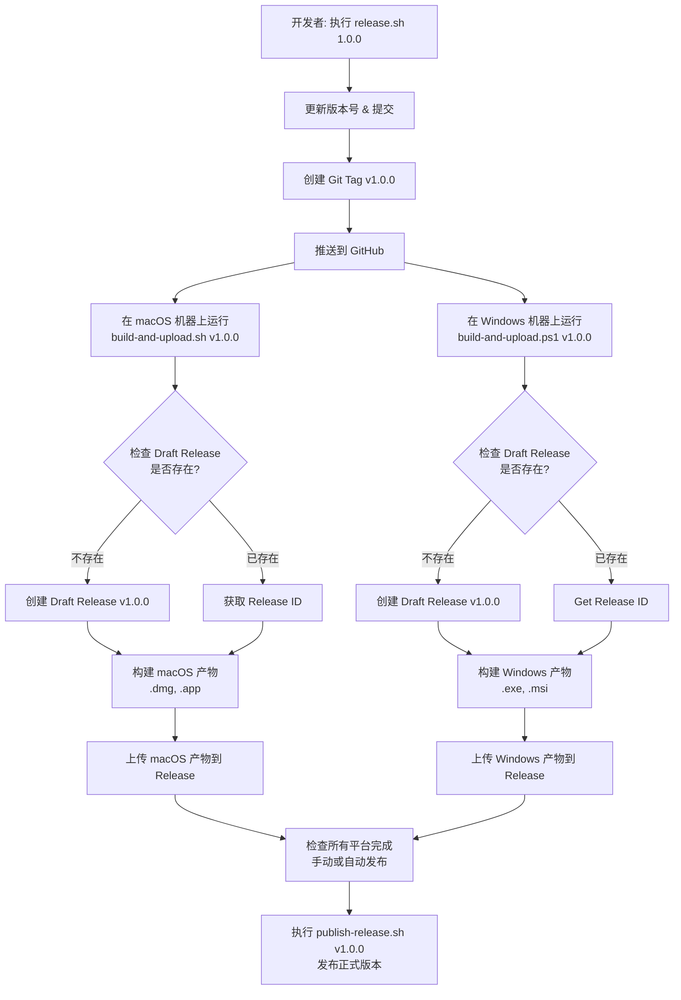

# Debugtron Tauri 发布流程指南

> 多平台本地构建和发布到 GitHub Releases 的完整流程

本指南详细描述了如何在不同的物理机器上构建 Windows 和 macOS 版本，并将它们上传到同一个 GitHub Release。

## 概述

### 核心挑战
1. **Windows 和 macOS 在不同物理机上构建**：无法使用单一 CI/CD 流水线
2. **需要向同一个 Release 上传多平台产物**：确保版本号一致性
3. **不使用 GitHub Actions**：完全本地脚本控制
4. **支持异步上传**：两个平台可以独立构建和上传

### 解决方案：Draft Release 策略 + GitHub CLI

使用 GitHub CLI (`gh`) 和 Draft Release 机制：
- 创建一个草稿状态的 GitHub Release
- 各平台异步上传产物到同一个草稿 Release
- 所有平台完成后，手动或自动发布正式 Release

## 架构设计



## 前置准备

### 1. 安装 GitHub CLI

**macOS**:
```bash
brew install gh
gh auth login
```

**Windows**:
```powershell
winget install --id GitHub.cli
gh auth login
```

### 2. 配置项目脚本

确保项目根目录下有 `scripts/` 目录，包含以下文件：
- `sync-version.cjs` - 版本号同步脚本
- `release.cjs` - 创建版本和 Git tag
- `build-and-upload.sh` - macOS 构建上传脚本
- `build-and-upload.ps1` - Windows 构建上传脚本
- `publish-release.cjs` - 发布 Release 脚本

## 脚本详情

### 1. 版本号同步脚本 (`scripts/sync-version.cjs`)

```javascript
const fs = require('fs');
const path = require('path');

// 读取 package.json 版本号
const packageJson = JSON.parse(
  fs.readFileSync(path.join(__dirname, '../package.json'), 'utf8')
);
const version = packageJson.version;

// 更新 Cargo.toml 版本号
const cargoTomlPath = path.join(__dirname, '../src-tauri/Cargo.toml');
let cargoToml = fs.readFileSync(cargoTomlPath, 'utf8');
cargoToml = cargoToml.replace(
  /^version = ".*"/m,
  `version = "${version}"`
);
fs.writeFileSync(cargoTomlPath, cargoToml);

// 更新 tauri.conf.json 版本号
const tauriConfPath = path.join(__dirname, '../src-tauri/tauri.conf.json');
const tauriConf = JSON.parse(fs.readFileSync(tauriConfPath, 'utf8'));
tauriConf.package.version = version;
fs.writeFileSync(tauriConfPath, JSON.stringify(tauriConf, null, 2));

console.log(`✅ Synced version to ${version}`);
```

配置 `package.json`:
```json
{
  "scripts": {
    "version": "node scripts/sync-version.cjs && git add src-tauri/Cargo.toml src-tauri/tauri.conf.json"
  }
}
```

### 2. 发版脚本 (`scripts/release.cjs`)

```javascript
const { execSync } = require('child_process');
const fs = require('fs');
const path = require('path');

const version = process.argv[2];

if (!version) {
  console.error('Usage: node scripts/release.cjs <version>');
  console.error('Example: node scripts/release.cjs 1.0.0');
  process.exit(1);
}

console.log(`📦 Preparing release v${version}...`);

try {
  // 1. 更新版本号
  execSync(`npm version ${version} --no-git-tag-version`, { stdio: 'inherit' });

  // 2. 同步版本号到所有配置文件
  require('./sync-version.cjs');

  // 3. 提交
  execSync('git add package.json package-lock.json src-tauri/Cargo.toml src-tauri/tauri.conf.json', { stdio: 'inherit' });
  execSync(`git commit -m "chore: release v${version}"`, { stdio: 'inherit' });

  // 4. 创建 tag
  execSync(`git tag "v${version}"`, { stdio: 'inherit' });

  // 5. 推送
  execSync('git push origin master', { stdio: 'inherit' });
  execSync(`git push origin "v${version}"`, { stdio: 'inherit' });

  console.log('');
  console.log('✅ Tag v${version} created and pushed!');
  console.log('');
  console.log('📋 Next steps:');
  console.log('  1. On macOS machine: ./scripts/build-and-upload.sh ${version}');
  console.log('  2. On Windows machine: .\\scripts\\build-and-upload.ps1 ${version}');
  console.log('  3. After both platforms complete: ./scripts/publish-release.sh ${version}');

} catch (error) {
  console.error('❌ Release process failed:', error.message);
  process.exit(1);
}
```

### 3. macOS 构建和上传脚本 (`scripts/build-and-upload.sh`)

> **多架构构建**：分别构建 ARM64 和 x86_64 架构，减少单个包体积

```bash
#!/bin/bash
set -e

VERSION=$1

if [ -z "$VERSION" ]; then
  echo "Usage: ./scripts/build-and-upload.sh <version>"
  echo "Example: ./scripts/build-and-upload.sh 1.0.0"
  exit 1
fi

TAG="v$VERSION"

echo "🍎 Building macOS version $VERSION for multiple architectures..."

# 1. 检查 Draft Release 是否存在
echo "📋 Checking if draft release exists..."
RELEASE_EXISTS=$(gh release view "$TAG" --json isDraft -q .isDraft 2>/dev/null || echo "false")

if [ "$RELEASE_EXISTS" = "false" ]; then
  echo "📝 Creating draft release $TAG..."
  if ! gh release create "$TAG" \
    --draft \
    --title "Release $VERSION" \
    --notes "Release notes for version $VERSION"; then
    echo "❌ Failed to create release!"
    exit 1
  fi
  echo "✅ Draft release created successfully"
else
  echo "✅ Draft release $TAG already exists"
fi

# 2. 安装依赖
echo "📦 Installing dependencies..."
npm install

# 定义架构列表
ARCHITECTURES=("aarch64-apple-darwin" "x86_64-apple-darwin")
ARCH_NAMES=("arm64" "x86_64")

# 用于收集所有产物路径
UPLOAD_ARGS=""

# 3. 遍历每个架构进行构建
for i in "${!ARCHITECTURES[@]}"; do
  ARCH="${ARCHITECTURES[$i]}"
  ARCH_NAME="${ARCH_NAMES[$i]}"

  echo ""
  echo "🔨 Building for $ARCH_NAME ($ARCH)..."

  # 构建指定架构
  npm run tauri build -- --target "$ARCH"

  # 查找构建产物
  DMG_PATH=$(find "src-tauri/target/$ARCH/release/bundle/dmg" -name "*.dmg" | head -n 1)
  APP_PATH="src-tauri/target/$ARCH/release/bundle/macos/Debugtron.app"

  if [ ! -f "$DMG_PATH" ]; then
    echo "❌ DMG file not found for $ARCH_NAME!"
    exit 1
  fi

  if [ ! -d "$APP_PATH" ]; then
    echo "❌ .app bundle not found for $ARCH_NAME!"
    exit 1
  fi

  # 打包 .app
  APP_ARCHIVE="Debugtron_${VERSION}_macOS_${ARCH_NAME}.app.tar.gz"
  echo "📦 Packaging $ARCH_NAME .app bundle..."
  tar -czf "$APP_ARCHIVE" -C "$(dirname "$APP_PATH")" "$(basename "$APP_PATH")"

  # 重命名 DMG 文件（直接复制为新文件名）
  DMG_RENAMED="Debugtron_${VERSION}_macOS_${ARCH_NAME}.dmg"
  echo "📝 Renaming DMG file..."
  cp "$DMG_PATH" "$DMG_RENAMED"

  # 添加到上传参数
  UPLOAD_ARGS="$UPLOAD_ARGS \"$DMG_RENAMED\" \"$APP_ARCHIVE\""

  echo "✅ $ARCH_NAME build complete"
  echo "   DMG: $DMG_RENAMED"
  echo "   APP: $APP_ARCHIVE"
done

# 4. 上传所有产物到 Release
echo ""
echo "⬆️  Uploading all macOS artifacts to release..."

# 使用 eval 执行动态构建的命令
if ! eval gh release upload "$TAG" "$UPLOAD_ARGS" --clobber; then
  echo "❌ Failed to upload artifacts!"
  exit 1
fi

# 5. 清理临时文件
echo ""
echo "🧹 Cleaning up temporary files..."
for ARCH_NAME in "${ARCH_NAMES[@]}"; do
  rm -f "Debugtron_${VERSION}_macOS_${ARCH_NAME}.dmg"
  rm -f "Debugtron_${VERSION}_macOS_${ARCH_NAME}.app.tar.gz"
done

echo ""
echo "✅ All macOS builds complete and uploaded!"
echo "   Architectures: ${ARCH_NAMES[*]}"
echo "   Release: $TAG"
```

**关键改进**:
- **多架构支持**: 分别构建 ARM64 和 x86_64，而非 Universal 包
- **体积优化**: 单架构包体积约为 Universal 包的 50%
- **灵活性**: 用户可根据自己的 Mac 架构下载对应版本
- **输出产物**:
  - `Debugtron_{VERSION}_macOS_arm64.dmg` - ARM64 DMG 安装包
  - `Debugtron_{VERSION}_macOS_arm64.app.tar.gz` - ARM64 应用程序包
  - `Debugtron_{VERSION}_macOS_x86_64.dmg` - x86_64 DMG 安装包
  - `Debugtron_{VERSION}_macOS_x86_64.app.tar.gz` - x86_64 应用程序包

### 4. Windows 构建和上传脚本 (`scripts/build-and-upload.ps1`)

```powershell
param(
    [Parameter(Mandatory=$true)]
    [string]$Version
)

$ErrorActionPreference = "Stop"
$TAG = "v$Version"

Write-Host "🪟 Building Windows version $Version..." -ForegroundColor Cyan

# 1. 检查 Draft Release 是否存在
Write-Host "📋 Checking if draft release exists..." -ForegroundColor Yellow
try {
    $releaseInfo = gh release view $TAG --json isDraft 2>$null | ConvertFrom-Json
    $releaseExists = $releaseInfo.isDraft
    Write-Host "✅ Draft release $TAG already exists" -ForegroundColor Green
} catch {
    Write-Host "📝 Creating draft release $TAG..." -ForegroundColor Yellow
    gh release create $TAG `
        --draft `
        --title "Release $Version" `
        --notes "Release notes for version $Version"
    $releaseExists = $true
}

# 2. 构建 Windows 应用
Write-Host "🔨 Building Windows application..." -ForegroundColor Yellow
npm install
npm run tauri build

# 3. 查找构建产物
$EXE_PATH = Get-ChildItem -Path "src-tauri\target\release\bundle\nsis" -Filter "*-setup.exe" -Recurse | Select-Object -First 1 -ExpandProperty FullName
$MSI_PATH = Get-ChildItem -Path "src-tauri\target\release\bundle\msi" -Filter "*.msi" -Recurse | Select-Object -First 1 -ExpandProperty FullName

if (-not $EXE_PATH) {
    Write-Host "❌ EXE installer not found!" -ForegroundColor Red
    exit 1
}

# 4. 重命名文件（带版本号）
$EXE_NAME = "Debugtron_${Version}_Windows_x64-setup.exe"
$MSI_NAME = "Debugtron_${Version}_Windows_x64.msi"

Copy-Item $EXE_PATH -Destination $EXE_NAME
if ($MSI_PATH) {
    Copy-Item $MSI_PATH -Destination $MSI_NAME
}

# 5. 上传到 Release
Write-Host "⬆️  Uploading Windows artifacts to release..." -ForegroundColor Yellow
if ($MSI_PATH) {
    gh release upload $TAG $EXE_NAME $MSI_NAME --clobber
} else {
    gh release upload $TAG $EXE_NAME --clobber
}

# 6. 清理临时文件
Remove-Item $EXE_NAME
if ($MSI_PATH) {
    Remove-Item $MSI_NAME
}

Write-Host ""
Write-Host "✅ Windows build complete and uploaded!" -ForegroundColor Green
Write-Host "   EXE: $EXE_NAME" -ForegroundColor Cyan
if ($MSI_PATH) {
    Write-Host "   MSI: $MSI_NAME" -ForegroundColor Cyan
}
```

### 5. 发布 Release 脚本 (`scripts/publish-release.cjs`)

```javascript
const { execSync } = require('child_process');
const readline = require('readline');

const version = process.argv[2];

if (!version) {
  console.error('Usage: node scripts/publish-release.cjs <version>');
  console.error('Example: node scripts/publish-release.cjs 1.0.0');
  process.exit(1);
}

const TAG = `v${version}`;

console.log(`🚀 Publishing release ${TAG}...`);

try {
  // 1. 检查 draft release 是否存在
  const releaseInfo = JSON.parse(execSync(`gh release view "${TAG}" --json isDraft,assets`, { encoding: 'utf8' }));

  if (!releaseInfo.isDraft) {
    console.error(`❌ Draft release ${TAG} not found or already published!`);
    process.exit(1);
  }

  // 2. 列出所有附件
  console.log('');
  console.log('📦 Release assets:');
  releaseInfo.assets.forEach(asset => {
    const sizeMB = Math.floor(asset.size / 1024 / 1024);
    console.log(`  - ${asset.name} (${sizeMB}MB)`);
  });

  // 3. 确认发布
  const rl = readline.createInterface({
    input: process.stdin,
    output: process.stdout
  });

  rl.question('\n❓ Publish this release? (y/N): ', (answer) => {
    rl.close();

    if (!answer.match(/^[Yy]$/)) {
      console.log('❌ Release not published');
      process.exit(1);
    }

    // 4. 发布
    execSync(`gh release edit "${TAG}" --draft=false`, { stdio: 'inherit' });

    const releaseUrl = execSync(`gh release view "${TAG}" --json url -q .url`, { encoding: 'utf8' }).trim();

    console.log('');
    console.log(`✅ Release ${TAG} published successfully!`);
    console.log(`🔗 ${releaseUrl}`);
  });

} catch (error) {
  console.error('❌ Error:', error.message);
  process.exit(1);
}
```

## 使用流程

### 完整发版流程

```bash
# Step 1: 在开发机器上创建版本和 tag（任意平台）
npm run release 1.0.0

# Step 2: 在 macOS 机器上构建并上传
./scripts/build-and-upload.sh 1.0.0

# Step 3: 在 Windows 机器上构建并上传
# PowerShell
.\scripts\build-and-upload.ps1 1.0.0

# Step 4: 确认所有平台完成后，发布 release（任意平台）
npm run publish-release 1.0.0
```

### NPM 脚本集成

配置 `package.json`:
```json
{
  "scripts": {
    "release": "node scripts/release.cjs",
    "publish-release": "node scripts/publish-release.cjs",
    "build-and-upload:macos": "./scripts/build-and-upload.sh",
    "build-and-upload:windows": ".\\scripts\\build-and-upload.ps1"
  }
}
```

## 关键特性

### ✅ 完全本地控制
- 不依赖 GitHub Actions 或其他云服务
- 可以在任何有 GitHub CLI 的机器上运行
- 支持离线构建，异步上传

### ✅ Draft Release 机制
- 多个平台可以异步上传到同一个草稿 Release
- 先创建草稿 Release，再上传产物
- 所有平台完成后，手动发布正式版本

### ✅ 幂等性
- 使用 `--clobber` 参数覆盖已有文件
- 脚本可以重复运行
- 支持断点续传

### ✅ 版本号一致性
- 自动同步 `package.json`、`Cargo.toml`、`tauri.conf.json` 的版本号
- 通过 `npm version` 命令统一管理

### ✅ 手动确认发布
- 最后一步需要人工确认
- 提供发布前检查和确认机制
- 避免意外发布

## 安全考虑

### GitHub 认证
- 使用 `gh auth login` 进行 OAuth 认证
- 不需要在脚本中硬编码 token
- 支持双因素认证 (2FA)
- token 存储在系统密钥链中

### 文件权限
- 脚本只生成临时文件，完成后自动清理
- 不上传敏感信息或源代码
- 产物通过 GitHub Releases 分发，有完整的安全扫描

## 故障排查

### 常见问题

#### 1. `gh: command not found`
**解决方案**:
```bash
# macOS
brew install gh

# Windows
winget install --id GitHub.cli

# Linux
sudo apt install gh  # 或使用其他包管理器
```

#### 2. `Error: authentication required`
**解决方案**:
```bash
gh auth login
```
按照提示完成认证流程。

#### 3. `Error: release already exists`
**解决方案**:
脚本已包含 `--clobber` 参数，会自动覆盖已有文件。如果 Release 已发布，需要先删除或创建新版本。

#### 4. 构建产物找不到
**解决方案**:
检查 Tauri 构建配置，确保 `tauri.conf.json` 中的 `bundle` 配置正确。

#### 5. 上传速度慢
**解决方案**:
- 检查网络连接
- 使用 `gh release upload --clobber` 支持断点续传
- 可以分步上传，先构建后上传

## 相关文件

- `scripts/sync-version.cjs` - 版本号同步
- `scripts/release.cjs` - 创建版本和 Git tag
- `scripts/build-and-upload.sh` - macOS 构建上传
- `scripts/build-and-upload.ps1` - Windows 构建上传
- `scripts/publish-release.cjs` - 发布 Release

## 自动化程度

| 步骤 | 自动化程度 | 备注 |
|------|------------|------|
| 版本号同步 | 全自动 | `npm version` + sync-version.cjs |
| 创建 Git tag | 全自动 | 自动提交和推送 |
| macOS 构建 | 全自动 | 多架构并行构建 |
| Windows 构建 | 全自动 | NSIS + MSI 安装包 |
| 上传产物 | 全自动 | 使用 GitHub CLI |
| 发布确认 | 手动 | 人工确认后发布 |

## 最佳实践

### 1. 版本号规范
- 使用语义化版本 (SemVer)：`MAJOR.MINOR.PATCH`
- 示例：`1.0.0`、`1.1.0`、`2.0.0`
- 通过 `npm version major|minor|patch` 自动升级

### 2. 预发布版本
支持预发布版本：
```bash
npm run release 1.0.0-beta.1
npm run release 1.0.0-rc.1
```

### 3. 多平台测试
- 先在本地测试构建
- 上传前验证产物完整性
- 在不同操作系统上测试安装包

### 4. 版本回滚
如果需要回滚：
```bash
# 1. 删除 tag
git tag -d v1.0.0
git push origin :refs/tags/v1.0.0

# 2. 删除 Release
gh release delete v1.0.0

# 3. 创建修复版本
npm run release 1.0.1
```

## 性能优化

### 构建缓存
- Tauri 使用 Rust 构建缓存
- 增量编译加速后续构建
- 可以配置 CI 缓存（如果使用 CI）

### 产物压缩
- DMG 使用压缩算法
- .app 打包为 tar.gz 节省空间
- 安装包内置压缩

### 并行构建
macOS 脚本支持：
- 多架构并行构建（如果机器性能允许）
- 可以扩展到其他架构（如 iOS）

## 扩展性

### 支持更多平台
可以扩展支持：
- **Linux**: 添加 `build-and-upload-linux.sh`
- **iOS**: 添加 iOS 构建脚本
- **Android**: 添加 Android 构建脚本

### 自定义发布渠道
可以扩展支持：
- **Beta 渠道**: 发布到不同的 GitHub Release
- **稳定渠道**: 主发布流程
- **开发渠道**: 每日构建

---

## 相关文档

- [ARCHITECTURE.md](ARCHITECTURE.md) - 系统架构设计
- [DEVELOPMENT_GUIDE.md](DEVELOPMENT_GUIDE.md) - 开发环境设置
- [DECISION_LOG.md](DECISION_LOG.md) - 技术决策记录
- [TODO.md](TODO.md) - 待完成事项

---

*最后更新: 2025-12-02*
*维护者: Debugtron Tauri 团队*
