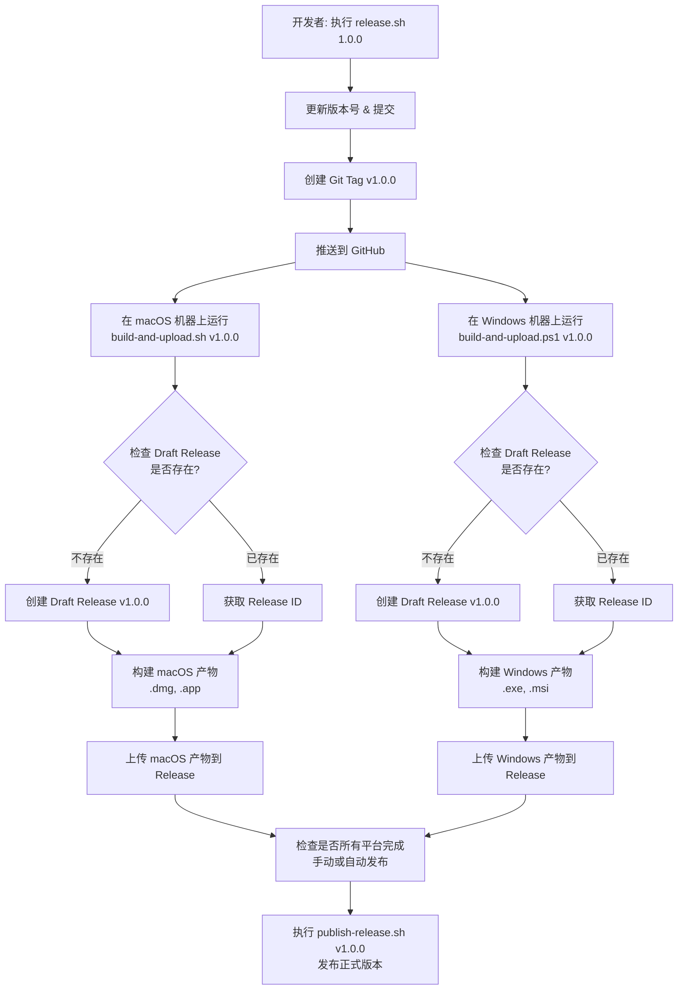

# Debugtron Tauri 迁移项目

> 将 Debugtron (Electron) 迁移到 Tauri + Rust 技术栈

## 项目概述

**目标**: 将原 Electron 项目迁移到 Tauri 技术栈，使用 Rust 重新实现后端逻辑，前端代码尽量复用。

**原项目**: Debugtron - Debug in-production Electron based App
- 自动发现本地 Electron 应用
- 一键启动调试会话
- 集成 Chrome DevTools (主进程 + 渲染进程)
- 实时日志监控

## 当前进度

### ✅ 已完成 (Phase 1-3)

#### 项目初始化
- [x] 分析原有 Electron 项目目录结构
- [x] 分析项目依赖和 package.json
- [x] 分析 Electron 主进程逻辑
- [x] 分析 Electron 渲染进程和 IPC 通信
- [x] 分析前端代码结构和技术栈
- [x] 制定 Tauri 迁移重构计划
- [x] 生成迁移计划文档 (`migration_plan.md`)

#### Tauri 项目搭建
- [x] 初始化 Tauri 项目结构
  - 创建 Rust 后端骨架 (`src-tauri/`)
  - 配置 Tauri 构建系统
  - 设置前端构建环境 (Vite + React)
  - 复制静态资源和图标

#### 核心架构实现
- [x] 实现 `TargetAdapter` trait 定义
- [x] 实现 `TargetRegistry` 管理器
- [x] 实现全局 `AppState` 状态管理
- [x] 实现基础 Tauri Commands
- [x] 实现事件系统 (Tauri Events)

#### macOS 平台支持
- [x] **实现 macOS 应用发现功能**
  - 扫描 `/Applications` 和 `~/Applications` 目录
  - 检测 Electron Framework 判断 Electron 应用
  - 解析 Info.plist 提取应用元数据
  - 实现 ICNS 图标提取和 Base64 编码
  - 支持 CFBundleIconFile 图标路径解析
  - 成功发现 22 个 Electron 应用

#### Windows 平台支持 ⭐ 2025-11-29
- [x] **实现 Windows 应用发现功能**
  - 扫描 Program Files, Program Files (x86), LocalAppData 目录
  - 检测 resources/app.asar 判断 Electron 应用
  - 解析 package.json 提取应用元数据
  - 实现三级图标提取策略：
    1. 文件模式：搜索 .ico/.png 图标文件
    2. 递归搜索：在 resources 目录递归查找图标
    3. PE 资源提取：使用 Windows API 从 .exe 提取图标
  - 使用 WalkDir 深度限制优化性能（max_depth=3）
  - 完整的 Windows API 集成（SHGetFileInfoW, ExtractIconW, CreateDIBSection, DrawIconEx）
  - 正确的 BGRA→RGBA 颜色转换和 PNG 编码

#### 前端迁移
- [x] **迁移前端组件并适配 Tauri API**
  - 移除 Electron 相关依赖
  - 替换 IPC 通信为 Tauri Commands/Events
  - 修改状态同步机制 (移除 electron-redux)
  - 实现 `useTauriEvents` Hook 监听后端事件
  - 修复组件中的 state selector 用法
  - UI 完整显示，与原项目一致

#### macOS 窗口集成
- [x] **修复 macOS 窗口装饰**
  - 启用原生 traffic lights (红黄绿按钮)
  - 设置透明标题栏 (`titleBarStyle: "Transparent"`)
  - 支持拖动窗口

#### 调试会话管理
- [x] **实现应用启动和调试端口分配**
  - 使用 `portpicker` 自动分配可用端口
  - 启动应用时传递 `--inspect` 和 `--remote-debugging-port` 参数
  - 正确处理进程 stdin/stdout/stderr
  - 修复 EPIPE 错误（设置 stdin 为 null，异步读取 stdout/stderr）

- [x] **实现调试目标发现 (Chrome DevTools Protocol)**
  - 轮询 Node.js Inspector 端口 (`http://127.0.0.1:{port}/json`)
  - 轮询 Chrome DevTools 端口（渲染进程）
  - 解析 JSON 响应获取可调试目标列表
  - 发送 `pages-updated` 事件到前端
  - 前端接收并更新 Redux state

- [x] **实现日志捕获和转发**
  - 异步读取应用 stdout/stderr 流
  - 通过 `session-log` 事件实时发送到前端
  - 前端累加日志到 session.log 字段
  - 在 UI 中显示日志输出
  - 修复 Xterm 组件性能问题（增量追加而非全量重写）
  - 修复 React 组件重渲染导致 Terminal 实例重建问题

- [x] **实现进程退出检测**
  - 监控子进程退出状态
  - 发送 `session-removed` 事件
  - 前端移除对应的 session 记录
  - UI 状态自动更新

- [x] **实现 DevTools 本地服务器集成** (Phase 4-5)
  - ✅ 实现本地 HTTP DevTools 服务器
  - ✅ 自动解压 Chrome DevTools 前端资源包
  - ✅ 使用 `axum` + `tower-http` 提供静态文件服务
  - ✅ 自动分配可用端口 (使用 `portpicker`)
  - ✅ 支持单例模式 (服务器复用，避免重复启动)
  - ✅ 根据进程类型智能选择 DevTools 前端：
    - `page` 类型（渲染进程，有 DOM）→ `front_end/inspector.html`
    - `node` 类型（主进程，无 DOM）→ `front_end/js_app.html`
  - ✅ 临时文件清理 (应用启动/退出时自动清理)
  - ✅ 完整的错误处理和日志记录

- [x] **实现双模式 DevTools 打开方式** (Phase 6) ⭐ 2025-11-28
  - ✅ **Tauri 窗口模式** (`open_devtools_window` 命令)
    - 在 Tauri 应用内创建新窗口显示 DevTools
    - 窗口大小：1200x800，可调整
    - 窗口去重：同一调试目标不会重复打开窗口
    - 窗口标签清理：正确处理 URL 中的特殊字符（`.` → `_`）
  - ✅ **浏览器模式** (`open_devtools` 命令)
    - 使用 `opener` crate 在系统默认浏览器中打开
    - 利用浏览器的完整功能和扩展
  - ✅ **前端 UI 更新**
    - 蓝色 "Inspect" 按钮 → Tauri 窗口模式
    - 绿色 "Open in Browser" 按钮 → 浏览器模式
    - 添加详细的前端日志和错误提示

- [x] **实现 Inspect-brk 调试模式** (Phase 7) ⭐ 2025-11-28
  - ✅ **后端支持**
    - 在 `LaunchOptions` 中添加 `inspect_brk` 字段
    - 启动时根据选项使用 `--inspect-brk={port}` 或 `--inspect={port}`
    - 更新 `debug` command 接受 `inspect_brk` 参数
  - ✅ **前端右键菜单**
    - 应用卡片支持右键点击
    - 显示两个选项：
      - "Debug" - 普通调试模式（应用正常启动）
      - "Debug with --inspect-brk" - 启动时暂停模式（在第一行代码暂停，等待调试器）
    - 点击外部自动关闭菜单
  - ✅ **用户体验优化**
    - 左键点击 = 普通调试
    - 右键点击 = 显示高级选项
    - 优雅的菜单样式和图标

### 🎉 Phase 1-8 完成！Windows 平台支持已实现！

**当前功能状态**：
- ✅ 自动发现本地 Electron 应用（**macOS + Windows**，22+ 应用）
- ✅ 一键启动调试会话（自动分配端口）
- ✅ 实时日志监控（stdout/stderr 流式传输）
- ✅ 调试目标发现（主进程 + 渲染进程）
- ✅ **本地 DevTools HTTP 服务器**
- ✅ **双模式 DevTools 打开方式**
  - 在 Tauri 窗口中打开（集成体验）
  - 在系统浏览器中打开（完整功能）
- ✅ **Inspect-brk 调试模式**
  - 支持启动时暂停（--inspect-brk）
  - 右键菜单选择调试模式
- ✅ **Windows 平台支持** ⭐ 最新！
  - 应用发现和 PE 资源图标提取
  - 三级图标提取策略（文件/递归/API）
- ✅ 进程退出检测（自动清理会话）

**用户工作流**：
1. 启动 Debugtron Tauri 应用
2. 查看已发现的 Electron 应用列表
3. **选择启动模式**：⭐ 新增！
   - 左键点击 → 普通调试模式（应用正常启动）
   - 右键点击 → 显示菜单：
     - "Debug" - 普通调试
     - "Debug with --inspect-brk" - 启动时暂停，等待调试器连接
4. 在进程表格中查看所有调试目标
5. **选择 DevTools 打开方式**：
   - 点击蓝色 "Inspect" 按钮 → 在 Tauri 窗口中打开 DevTools
   - 点击绿色 "Open in Browser" 按钮 → 在浏览器中打开 DevTools
6. 直接在 DevTools 中调试应用
7. 查看实时日志输出

### 🚧 待完成 (Phase 5+)

### 📋 待完成

> 基于功能扩展深度调研（`.claude/plan/`），以下为优先级排序的开发路线图

#### 立即行动 (本周-下周，1-2 周完成) 🔥 P0
- [ ] **日志搜索和导出功能**（2-3 天）
  - 实现字符串匹配 + 正则表达式搜索
  - 导出为 .txt / .json / .csv 格式
  - **价值**: 用户满意度 +30%，支持日志分享

- [ ] **会话导出/导入**（2 天）
  - JSON 格式保存完整会话（日志、状态、配置）
  - 支持会话重放和分享
  - **价值**: 支持 PR 审查和远程协助场景

- [ ] **预设启动配置**（2 天）
  - 保存自定义启动参数（环境变量、flags）
  - 快速切换常用配置
  - **价值**: 重度用户体验 +40%

#### 短期目标 (3 个月内) 🎯 P1

**Phase 1: 日志和协作增强**（Week 1-2）
- [ ] 日志搜索/过滤/导出
- [ ] 会话导出/导入
- [ ] 快照对比（修复前后）
- [ ] 预设启动配置

**Phase 2: CDP 基础集成**（Week 3-5）
- [ ] WebSocket CDP 连接基础设施
- [ ] Runtime.evaluate（REPL 代码执行）
- [ ] console.log/warn/error 日志分类
- [ ] 实时性能指标（内存、CPU）

**Phase 3: IPC 调试 + 网络监控**（Week 6-9）
- [ ] IPC 消息追踪（**市场独有功能**）
- [ ] IPC 消息流可视化（时序图）
- [ ] HTTP 请求追踪
- [ ] 请求/响应查看器

**Phase 4: Linux 平台支持**（Week 10-12）
- [ ] 扫描 `.desktop` 文件
- [ ] 检测 Electron 应用特征
- [ ] 提取应用图标
- [ ] 稳定性测试

#### 中期目标 (Q2: Month 4-6) 🚀 P2

- [ ] **深度调试能力**
  - 完整性能分析面板（CPU 火焰图、内存时间线）
  - CLI 工具和 CI/CD 集成
  - 完整调试器（断点、调用栈、变量）
  - 插件系统框架

- [ ] **远程设备调试** (可选)
  - ADB 连接 Android 设备
  - 远程 WebSocket 连接

#### 长期目标 (Q3-Q4: Month 7-12) 🌟 P3

**Q3 (Month 7-9): 协作和生态**
- [ ] 实时协作（WebSocket 会话分享）
- [ ] 问题库和知识管理
- [ ] 应用市场（调试配置分享）

**Q4 (Month 10-12): 生产和自动化**
- [ ] 生产监控网关（本地部署）
- [ ] 崩溃报告和错误追踪
- [ ] AI 辅助诊断（实验性）

#### 测试和优化 (持续进行)
- [ ] 完整测试所有功能
  - 端到端测试
  - 跨平台兼容性测试
- [ ] 性能优化
  - 减少事件发送频率
  - 优化大量日志输出

#### 发版自动化 (Phase 9)
- [ ] **实现多平台自动发版系统**
  - 设计 GitHub Actions Workflow
  - 配置 Self-hosted Runners
  - 实现 Draft Release 策略
  - 自动构建和上传产物

## 关键文档

- **`migration_plan.md`**: 完整的迁移计划和技术分析文档
  - 原项目详细分析
  - Electron → Tauri 架构映射
  - Rust 代码实现方案
  - 前端调整策略
  - 分阶段实施计划

- **`.claude/plan/`**: 功能扩展深度调研报告 ⭐ 2025-12-01 新增
  - **`README.md`**: 调研概览和快速导航
  - **`feature-research.md`**: 综合报告（50+ 功能创意，MVP 设计，12 个月路线图）
  - **`01-cdp-capability-audit.md`**: CDP 能力审计（现有能力 vs 未利用功能）
  - **`02-competitive-analysis.md`**: 竞品分析（9 个工具对比，开发者痛点 Top 10）
  - **`03-workflow-collaboration.md`**: 工作流和协作（4 种典型场景，团队需求）
  - **`04-architecture-implementation-plan.md`**: 功能分层架构与 12 周实施计划 ⭐⭐ 最新！
  - 调研涵盖：开发体验提升、深度调试能力、团队协作、生产环境调试

## 技术栈

### 前端 (复用原项目)
- React 19 + TypeScript
- Redux Toolkit (状态管理)
- Radix UI (组件库)
- TailwindCSS (样式)
- xterm.js (终端)

### 后端 (重新实现)
- **框架**: Tauri 1.5
- **语言**: Rust
- **核心 Crates**:
  - `tokio` - 异步运行时
  - `serde` - 序列化/反序列化
  - `anyhow` - 错误处理
  - `portpicker` - 端口分配
  - `axum` + `tower-http` - DevTools HTTP 服务器
  - `opener` - 系统浏览器打开
- **平台特定**:
  - macOS: `plist` (Info.plist 解析)
  - Windows: `winapi` (Windows API), `winreg` (注册表), `walkdir` (目录遍历), `image` (图标编码)

## 核心模块

### 1. 目标设备适配器 (`src-tauri/src/targets/`)
负责不同平台和设备类型的应用发现和调试连接：
- **LocalTargetAdapter**: 本地平台 (macOS/Windows/Linux)
- **AdbTargetAdapter**: Android 远程调试 (可选)

### 2. Tauri Commands (`src-tauri/src/commands.rs`)
前端调用的 Rust 命令：
- `debug(app_info)` - 启动调试会话
- `add_remote_device(options)` - 添加远程设备
- `refresh_device_apps(target_id)` - 刷新应用列表
- `open_devtools(url)` - 打开 DevTools 窗口

### 3. 状态管理 (`src-tauri/src/state.rs`)
全局状态：
- `targets`: 已注册的目标设备
- `sessions`: 活跃的调试会话
- `apps`: 已发现的应用列表

### 4. 前端组件 (`src/components/`)
- `App.tsx` - 主容器
- `DeviceSidebar.tsx` - 设备列表
- `DevicePanel.tsx` - 应用列表
- `Session.tsx` - 调试会话界面
- `Xterm.tsx` - 终端组件

## 功能分层架构与实施计划 ⭐⭐ 2025-12-01 最新

> **完整文档**: `.claude/plan/04-architecture-implementation-plan.md`

### 核心架构决策

#### 1. 构建系统策略
- **决策**: 暂不独立化，直接在现有 GN 构建系统上二次开发 DevTools Frontend
- **路径**: `/Users/gemini/Documents/apifox/devtools-frontend/front_end`
- **理由**: 降低初期复杂度，快速产出功能

#### 2. 功能分层原则

```
需要界面的功能     → DevTools Frontend 实现 (60%)
可纯 Rust 实现的   → Debugtron Tauri 实现 (30%)
混合功能           → 分层协同 (10%)
所有功能           → 设计为未来可通过 MCP 暴露给 AI
```

### 功能分层矩阵

| 功能 | 实现层 | 技术方案 | 工作量 | MCP 工具 |
|-----|-------|---------|-------|---------|
| **日志搜索/导出** | Rust/Tauri | 后端索引 + Tauri Command | 2-3 天 | `search_logs`, `export_logs` |
| **会话导出/导入** | Rust/Tauri | JSON Schema v1.0 序列化 | 2 天 | `export_session`, `import_session` |
| **预设启动配置** | Rust/Tauri | 本地 JSON 文件存储 | 2 天 | `save_launch_config` |
| **CDP WebSocket** | Rust/Tauri | `tokio-tungstenite` 客户端 | 3 天 | 基础设施 |
| **Runtime.evaluate** | 混合 | Rust CDP + 前端 REPL UI | 2 天 | `execute_code` |
| **console 分类** | 混合 | Rust 监听 + 前端 UI | 2 天 | `get_console_logs` |
| **IPC 消息追踪** ⭐ | 混合 | Rust Hook + DevTools Panel | 1 周 | `get_ipc_messages` |
| **网络请求追踪** | DevTools Frontend | 扩展 Network Panel | 1 周 | `get_network_requests` |
| **性能分析** | DevTools Frontend | 扩展 Performance Panel | 2 周 | `analyze_performance` |

### IPC 调试非侵入式方案 ⭐ 核心差异化

**技术架构**:
```
Debugtron Tauri (启动时)
  ↓ --require 参数注入
Hook Script (ipc-hook-{session_id}.js)
  ↓ Proxy 拦截 ipcMain/ipcRenderer
IPC Debug WebSocket Server (Rust)
  ↓ 存储 + 转发
DevTools IPC Panel (新建面板)
```

**关键特性**:
- ✅ **非侵入式**: 通过 `--require` 注入 Hook 脚本，无需修改被调试应用
- ✅ **完整捕获**: 拦截所有 ipcMain.handle/on 和 ipcRenderer.send/invoke 调用
- ✅ **实时可视化**: 在 DevTools 新建 IPC Debugger Panel 显示消息流
- ✅ **性能分析**: 记录每次 IPC 调用的耗时和状态

**实现文件**:
- `src-tauri/src/ipc_debugger.rs` - IPC WebSocket 服务器
- `src-tauri/resources/ipc-hook-template.js` - Hook 脚本模板
- `devtools-frontend/front_end/panels/ipc_debugger/IpcDebuggerPanel.ts` - DevTools 面板

### MCP 架构设计（面向 AI）

**12 个核心 MCP 工具**:

| 工具名称 | 功能 | AI 场景示例 |
|---------|------|-----------|
| `list_sessions` | 列出活跃会话 | "显示正在调试的应用" |
| `search_logs` | 搜索日志 | "查找错误日志" |
| `export_logs` | 导出日志 | "导出为 JSON" |
| `export_session` | 导出会话 | "保存调试会话" |
| `get_ipc_messages` | 获取 IPC 消息 | "显示 IPC 通信" |
| `analyze_ipc_flow` | 分析 IPC 流 | "检测 IPC 延迟" |
| `get_network_requests` | 获取网络请求 | "显示失败的 HTTP 请求" |
| `analyze_performance` | 性能分析 | "检查内存泄漏" |

**技术选型**: JSON-RPC 2.0 (MCP 官方标准)

**实现文件**: `src-tauri/src/mcp_server.rs`

### 12 周实施路线图

#### Week 1-2: MVP v1.1 - 日志和协作增强
- 日志搜索/导出功能
- 会话导出/导入
- 预设启动配置

#### Week 3-5: MVP v1.2 - CDP 基础集成
- WebSocket CDP 连接
- Runtime.evaluate + REPL UI
- console.log 分类
- 实时性能指标

#### Week 6-9: MVP v1.3 - IPC 调试 + 网络监控 ⭐⭐
- IPC WebSocket 服务器
- Hook 脚本注入
- DevTools IPC Panel
- 消息流可视化
- 网络请求追踪

#### Week 10-12: Linux 平台 + MCP 集成
- Linux 应用发现
- MCP JSON-RPC 服务器
- 12 个工具实现

**成功指标**:
- Week 2: 日志搜索/导出可用，用户满意度 +30%
- Week 5: CDP 代码执行可用，交互式调试达成
- Week 9: IPC 调试可用，市场差异化优势建立
- Week 12: MCP 集成完成，AI 工具可调用

## 下一步行动

> 基于功能扩展深度调研（`.claude/plan/`），以下为具体的执行计划

### 本周目标（Week 1）🔥
**目标**: MVP v1.1 - 日志和协作增强（第一批功能）

1. **日志搜索功能** (2-3 天)
   - [ ] 实现前端搜索 UI（搜索框 + 正则开关）
   - [ ] 实现 Rust 后端日志索引（内存 or 文件）
   - [ ] 支持字符串匹配和正则表达式
   - [ ] 高亮显示匹配结果

2. **日志导出功能** (1 天)
   - [ ] 导出为 .txt 格式（纯文本）
   - [ ] 导出为 .json 格式（结构化）
   - [ ] 导出为 .csv 格式（表格）
   - [ ] 添加导出按钮和文件选择对话框

### 下周目标（Week 2）⚡
**目标**: 完成会话管理和预设配置

3. **会话导出/导入** (2 天)
   - [ ] 定义 Session JSON Schema v1.0
   - [ ] 实现导出逻辑（序列化完整会话）
   - [ ] 实现导入逻辑（反序列化并恢复）
   - [ ] 前端 UI（导出/导入按钮）

4. **预设启动配置** (2 天)
   - [ ] 设计配置数据结构（环境变量、flags、路径）
   - [ ] 实现配置存储（JSON 文件）
   - [ ] 前端配置管理 UI（保存/加载/删除）
   - [ ] 启动时应用预设配置

### 本月目标（Week 3-4）🎯
**目标**: CDP WebSocket 基础设施搭建

5. **CDP WebSocket 集成** (5-7 天)
   - [ ] 添加 `tokio-tungstenite` 依赖
   - [ ] 实现 CDP WebSocket 客户端 (`src-tauri/src/cdp/client.rs`)
   - [ ] 实现消息编码/解码 (`src-tauri/src/cdp/types.rs`)
   - [ ] 连接生命周期管理（连接、重连、断线）
   - [ ] 基础错误处理和日志

6. **Runtime.evaluate 支持** (2-3 天)
   - [ ] 实现 `Runtime.evaluate` CDP 方法
   - [ ] 前端 REPL UI（代码输入框 + 执行按钮）
   - [ ] 显示执行结果（成功/错误）
   - [ ] 基础代码历史记录

### 三个月里程碑 🌟
- ✅ 功能覆盖率从 70% → 85%
- ✅ IPC 调试（市场差异化）
- ✅ 网络监控（基础版）
- ✅ 三大平台完整支持（macOS + Windows + Linux）

## 开发指南

### 项目结构
```
debugtron-tauri/
├── src/                    # 前端代码 (React)
├── src-tauri/              # Rust 后端
│   ├── src/
│   │   ├── main.rs
│   │   ├── commands.rs
│   │   ├── state.rs
│   │   └── targets/
│   ├── Cargo.toml
│   └── tauri.conf.json
├── migration_plan.md       # 迁移计划文档
└── claude.md              # 本文件
```

### 常用命令
```bash
# 开发模式
npm run tauri dev

# 构建
npm run tauri build

# 运行测试
cargo test

# 格式化代码
cargo fmt
npm run lint
```

### Git 工作流
```bash
# 功能分支
git checkout -b feature/target-adapter
git commit -m "feat: implement LocalTargetAdapter"
git push origin feature/target-adapter

# 合并到主分支
git checkout main
git merge feature/target-adapter
```

## 技术决策记录

### 2025-11-26: 状态同步方案
**问题**: Electron 使用 `electron-redux` 自动同步主进程/渲染进程状态，Tauri 如何实现？

**决策**: 使用 Tauri Events 手动同步
- Rust 端维护单一状态源
- 状态变更时通过 `app.emit_all()` 发送事件
- 前端监听事件并 dispatch Redux actions

**理由**:
- 避免双向同步冲突
- 更清晰的数据流
- 更好的性能控制

### 2025-11-26: 错误处理策略
**问题**: Rust 和 TypeScript 的错误类型如何统一？

**决策**: 使用 `anyhow::Error` + 字符串传递
- Rust 端使用 `anyhow::Error` 处理所有错误
- Tauri Command 返回 `Result<T, String>`
- 前端接收错误字符串并显示

**理由**:
- 简单直接
- 避免复杂的错误类型序列化
- 符合 Tauri 最佳实践

### 2025-11-26: macOS ICNS 图标提取
**问题**: 如何在 Rust 中提取 macOS `.icns` 文件中的图标？

**决策**: 手动解析 ICNS 格式并提取 PNG 数据
- 读取 ICNS 文件二进制数据
- 解析 ICNS 容器格式 (magic number + size + entries)
- 查找嵌入的 PNG 图像数据 (检查 PNG 签名 `89 50 4E 47`)
- 转换为 Base64 data URI

**实现细节**:
```rust
// ICNS 格式: [magic:4字节][size:4字节][entries...]
// Entry 格式: [type:4字节][size:4字节][data:n字节]
// 选择最大的 PNG entry
```

**理由**:
- 避免依赖复杂的图像处理库
- 只需要提取已有的 PNG 数据,无需解码/编码
- 代码简洁,性能好
- 相关实现: `src-tauri/src/targets/platforms/macos.rs:128-232`

### 2025-11-27: 事件时序问题解决
**问题**: 后端在初始化时发送 `target-registered` 和 `apps-updated` 事件，但前端监听器还未注册，导致数据丢失。

**决策**: 混合推/拉模式
- 保留事件推送机制用于实时更新
- 添加 `get_targets()` 和 `get_apps()` 命令供前端主动拉取
- 前端在注册监听器后立即调用这两个命令获取初始数据

**理由**:
- 解决事件时序问题
- 保持实时更新能力
- 前端可以控制数据同步时机
- 相关实现: `src-tauri/src/commands.rs:53-79`, `src/hooks/useTauriEvents.ts:89-104`

### 2025-11-27: 进程 I/O 管理
**问题**: 启动 Electron 应用后出现 "write EPIPE" 错误，应用崩溃。

**决策**: 正确处理子进程的 stdin/stdout/stderr
- 设置 `stdin(Stdio::null())` 避免 EPIPE 错误
- 将 stdout/stderr 设为 `piped()` 并异步读取
- 在独立的 tokio task 中持续读取输出流
- 监控进程退出状态

**关键代码**:
```rust
let mut child = command
    .stdin(std::process::Stdio::null())  // 防止 EPIPE
    .stdout(std::process::Stdio::piped())
    .stderr(std::process::Stdio::piped())
    .spawn()?;

// 异步读取 stdout
tokio::spawn(async move {
    let reader = BufReader::new(stdout);
    let mut lines = reader.lines();
    while let Ok(Some(line)) = lines.next_line().await {
        // 发送到前端
    }
});
```

**理由**:
- 避免子进程向已关闭的 stdin 写入
- 防止 stdout/stderr 缓冲区满导致阻塞
- 实现实时日志捕获
- 相关实现: `src-tauri/src/targets/local/mod.rs:103-177`

### 2025-11-27: 日志转发架构
**问题**: 如何将子进程的日志实时传输到前端 UI？

**决策**: 通过 Tauri Events 流式传输
- 在 `LaunchOptions` 中添加 `app_handle: Option<AppHandle>` 字段
- 读取日志时通过 `app_handle.emit_all("session-log", data)` 发送
- 前端监听 `session-log` 事件并累加到 Redux store
- 日志数据包含 sessionId, connectionId, type (stdout/stderr), message

**数据流**:
```
子进程 stdout/stderr
  → tokio task 异步读取
  → emit_all("session-log")
  → 前端 useTauriEvents
  → dispatch(sessionLogAppended)
  → Redux store
  → UI 显示
```

**理由**:
- 实时性好，逐行发送
- 前端可以单独处理 stdout 和 stderr
- 与现有事件系统一致
- 相关实现: `src-tauri/src/targets/local/mod.rs:117-161`, `src/hooks/useTauriEvents.ts:54-59`

### 2025-11-27: Xterm 日志显示性能优化
**问题**: Xterm 终端在启动应用时能看到日志，但一段时间后日志消失，变成纯黑屏幕。

**根本原因分析**:
1. **错误的写入方法**: 初始代码使用 `writeln(content)` 尝试写入包含数万字符的多行字符串，导致性能问题
2. **组件重复挂载**: Session 组件中内联创建的 `options` 对象每次渲染都是新引用
3. **Terminal 实例重建**: 每次 `session.log` 累加触发 Redux 更新 → Session 重渲染 → 新的 options 引用 → Xterm useEffect 触发 → 创建新 Terminal 实例 → `lastContentLengthRef` 重置为 0
4. **重复全量写入**: 每次都从头重写全部日志内容（18000+ 字符），导致性能下降和闪烁

**决策**: 增量日志追加 + 组件优化
1. **Xterm 组件改进** (`src/xterm.tsx`):
   - 使用 `write()` 代替 `writeln()` 处理多行内容
   - 使用 `lastContentLengthRef` 追踪已写入的日志长度
   - 只追加新增的日志片段（`content.slice(lastLength)`）
   - 只在内容重置时才 `clear()` 并重写

2. **Session 组件优化** (`src/session.tsx`):
   - 使用 `useMemo` 缓存 `xtermOptions` 对象
   - 确保 options 引用稳定，避免 Terminal 实例重建

**实现细节**:
```typescript
// xterm.tsx - 增量追加逻辑
const lastLength = lastContentLengthRef.current;
if (content.length > lastLength) {
  const newContent = content.slice(lastLength);  // 只取新增部分
  termRef.current.write(newContent);             // 追加而非重写
  lastContentLengthRef.current = content.length;
}

// session.tsx - 稳定的 options 引用
const xtermOptions = useMemo(() => ({
  fontFamily: "SFMono-Regular, Consolas, Liberation Mono, Menlo, monospace",
  convertEol: true,
}), []);
```

**理由**:
- 避免每次重写全部内容，大幅提升性能
- 保持 Terminal 实例稳定，避免重复创建销毁
- 正确使用 `write()` API 处理多行内容
- 相关实现: `src/xterm.tsx:28-50`, `src/session.tsx:17-20`

### 2025-11-27: DevTools 浏览器打开实现
**问题**: 如何在系统浏览器中打开 Chrome DevTools？

**挑战**:
1. Tauri 不支持 `devtools://` 自定义协议
2. Chrome DevTools Protocol 返回多种 URL 格式
3. 需要在系统浏览器中打开而非 Tauri 窗口

**决策**: 使用本地 HTTP 服务器 + `opener` crate
1. **启动本地 DevTools HTTP 服务器**:
   - 使用 `axum` + `tower-http` 提供静态文件服务
   - 自动解压 Chrome DevTools 前端资源包
   - 自动分配可用端口

2. **使用 opener crate 打开浏览器**:
   ```rust
   opener::open(&local_devtools_url).map_err(|e| e.to_string())?
   ```

3. **前端直接传递原始 URL**:
   - 不在前端进行协议转换
   - 后端统一处理所有 URL 格式

**理由**:
- 在系统默认浏览器中打开，用户体验更好
- 使用本地 DevTools 前端，避免网络依赖
- 避免在 Tauri 窗口中实现复杂的 WebView 集成
- 支持所有 Chrome DevTools Protocol 标准 URL 格式
- 相关实现: `src-tauri/src/commands.rs:50-95`, `src/session.tsx:171-182`

### 2025-11-28: 双模式 DevTools 打开方式
**问题**: 用户需要在不同场景下使用不同的 DevTools 打开方式

**需求分析**:
- **集成体验**: 在应用内直接打开 DevTools，无需切换窗口
- **完整功能**: 在浏览器中打开，利用浏览器扩展和完整功能

**决策**: 实现两种 DevTools 打开模式
1. **Tauri 窗口模式** (`open_devtools_window` 命令):
   - 使用 `tauri::WindowBuilder` 创建新窗口
   - 加载本地 DevTools HTTP 服务器 URL
   - 窗口大小：1200x800，可调整
   - 窗口去重：检查窗口是否已存在，存在则聚焦

2. **浏览器模式** (`open_devtools` 命令):
   - 使用 `opener` crate 在系统默认浏览器中打开
   - 利用浏览器的完整功能和扩展

3. **窗口标签命名规则**:
   - 只允许字母数字、`-`、`/`、`:` 和 `_`
   - 将 WebSocket URL 中的特殊字符替换：
     - `://` → `-`
     - `/` → `-`
     - `:` → `-`
     - `.` → `_` (关键修复)

**前端 UI 设计**:
- 蓝色 "Inspect" 按钮 → Tauri 窗口模式（主推）
- 绿色 "Open in Browser" 按钮 → 浏览器模式（备选）
- 添加详细的错误提示和日志

**理由**:
- 提供灵活的使用方式，满足不同用户需求
- Tauri 窗口模式提供更好的集成体验
- 浏览器模式提供更完整的功能支持
- 窗口去重避免资源浪费
- 相关实现: `src-tauri/src/commands.rs:97-158`, `src/session.tsx:159-182`
- 依赖: `tauri::Manager` trait

### 2025-11-28: 渐进式轮询优化
**问题**: 点击 Debug 按钮后应用立刻启动，但调试目标和日志延迟 1-3 秒才显示

**根本原因**:
1. 轮询间隔固定 3 秒，首次轮询有延迟
2. 应用启动需要时间，过早轮询会失败
3. 活跃会话和新会话使用相同的轮询频率，浪费资源

**决策**: 使用渐进式轮询策略 + 会话状态跟踪 + 即时触发机制

**实现细节**:
```rust
// 1. 定义会话状态结构
#[derive(Clone, Debug)]
pub struct SessionState {
    pub connection: DebugConnection,
    pub active: bool,      // 是否已发现调试目标
    pub poll_count: u32,   // 轮询次数计数
}

// 2. 添加即时触发通知器
pub struct AppState {
    // ...
    pub poll_trigger: Arc<tokio::sync::Notify>,
}

// 3. 启动会话后立即触发轮询
pub async fn debug_app(&self, app_info: &AppInfo) -> Result<()> {
    // ... 启动应用 ...
    self.poll_trigger.notify_one();  // 立即触发轮询
    Ok(())
}

// 4. 渐进式轮询逻辑
fn start_polling(&self) {
    loop {
        tokio::select! {
            _ = sleep(Duration::from_millis(100)) => {}  // 100ms 基础间隔
            _ = state.poll_trigger.notified() => {}      // 或即时触发
        }

        for (session_id, session_state) in sessions.iter_mut() {
            session_state.poll_count += 1;

            // 渐进式轮询策略
            let should_poll = if !session_state.active {
                // 新会话：每 100ms 激进轮询
                true
            } else {
                // 活跃会话：每 3 秒轮询一次（poll_count % 30 == 0）
                session_state.poll_count % 30 == 0
            };

            // 首次发现调试目标后标记为 active
            if found_any && !session_state.active {
                session_state.active = true;
            }
        }
    }
}
```

**理由**:
- 启动后立即轮询，无需等待定时器
- 新会话频繁轮询（100ms），快速发现调试目标
- 活跃会话降低频率（3s），节省资源
- 使用 `tokio::select!` 支持即时触发和定时轮询
- 响应速度提升 10-30 倍
- 相关实现: `src-tauri/src/state.rs:9-22, 122-141, 190-304`

### 2025-11-28: 多会话 Tab 同步和 SessionId 一致性修复
**问题**: 同时调试多个应用时，Tab 内容与选中的 Tab 不匹配

**症状描述**:
1. 调试两个应用时，选中的 Tab 显示另一个应用的内容
2. 进程表格内容正常，但 Xterm 终端不显示日志
3. 关闭 DevTools 窗口导致所有调试会话终止

**根本原因分析**:
1. **数组索引匹配错误**:
   - 后端发送 `Vec<Vec<PageInfo>>` 格式的 pages 数据
   - 前端使用 `Object.keys(state)[i]` 和 `payload[i]` 进行索引匹配
   - Object 键的迭代顺序不保证与后端数组索引一致
   - 导致 sessionId 与 pages 数据错位

2. **SessionId 不一致**:
   - 后端使用 `connection_id` (UUID) 作为 session 键
   - 前端在添加 session 时错误使用 `appId`
   - 日志事件中使用 `app_id` 而非 `conn_id`
   - 导致日志无法正确关联到对应的 session

3. **窗口事件处理过于激进**:
   - `on_window_event` 对所有窗口销毁事件执行清理
   - 关闭 DevTools 窗口触发了全局清理逻辑

**解决方案**:

1. **改用 HashMap 进行精确匹配** (`src-tauri/src/state.rs:184-226`):
```rust
// Before: 使用 Vec 导致索引匹配问题
let mut all_pages: Vec<Vec<serde_json::Value>> = Vec::new();
for (_session_id, connection) in sessions.iter() {
    if !session_pages.is_empty() {
        all_pages.push(session_pages);  // 只推送值，丢失 session_id
    }
}

// After: 使用 HashMap 保持 sessionId -> pages 映射
let mut all_pages: std::collections::HashMap<String, Vec<serde_json::Value>>
    = std::collections::HashMap::new();
for (session_id, connection) in sessions.iter() {
    if !session_pages.is_empty() {
        all_pages.insert(session_id.clone(), session_pages);
    }
}
```

2. **更新 Redux Reducer 类型和逻辑** (`src/store/session.ts:62-78`):
```typescript
// Before: 使用数组索引匹配
pageUpdated: (state, { payload }: PayloadAction<PageInfo[][]>) => {
  Object.keys(state).forEach((sessionId, i) => {
    const session = state[sessionId];
    const pages = payload[i];  // ❌ 索引可能不匹配
  });
}

// After: 使用 sessionId 键匹配
pageUpdated: (state, { payload }: PayloadAction<Record<string, PageInfo[]>>) => {
  Object.entries(payload).forEach(([sessionId, pages]) => {
    const session = state[sessionId];  // ✅ 精确匹配
    if (session && pages) {
      session.page = {};
      pages.sort((a, b) => (a.id < b.id ? -1 : 1)).forEach((p) => {
        session.page[p.id] = p;
      });
    }
  });
}
```

3. **统一 SessionId 使用 connectionId** (`src/hooks/useTauriEvents.ts:41-48`):
```typescript
// Before: 错误使用 appId
dispatch(sessionAdded({
  sessionId: session.appId,  // ❌ 错误
  appId: session.appId,
  targetId: session.targetId,
  connection: session.connection,
}));

// After: 使用 connectionId (UUID)
dispatch(sessionAdded({
  sessionId: session.connectionId,  // ✅ 正确
  appId: session.appId,
  targetId: session.targetId,
  connection: session.connection,
}));
```

4. **修复日志事件 SessionId** (`src-tauri/src/targets/local/mod.rs:128-159`):
```rust
// Before: 使用 app_id_clone
let log_data = serde_json::json!({
    "sessionId": app_id_clone,  // ❌ 错误
    "connectionId": conn_id,
    "type": "stdout",
    "message": line
});

// After: 使用 conn_id
let log_data = serde_json::json!({
    "sessionId": conn_id,  // ✅ 正确
    "connectionId": conn_id,
    "type": "stdout",
    "message": line
});
```

5. **修复进程退出事件** (`src-tauri/src/targets/local/mod.rs:174`):
```rust
// Before: 发送 app_id
let _ = h.emit_all("session-removed", &app_id_exit);  // ❌

// After: 发送 conn_id
let _ = h.emit_all("session-removed", &conn_id_exit);  // ✅
```

6. **窗口生命周期管理** (`src-tauri/src/main.rs:39-50`):
```rust
// Before: 所有窗口销毁都清理
.on_window_event(|event| {
    if let tauri::WindowEvent::Destroyed = event.event() {
        println!("[MAIN] Window destroyed, cleaning up DevTools temp...");
        if let Err(e) = devtools_server::cleanup_devtools_temp() {
            eprintln!("[MAIN] Failed to clean DevTools temp on exit: {}", e);
        }
    }
})

// After: 只在主窗口销毁时清理
.on_window_event(|event| {
    if let tauri::WindowEvent::Destroyed = event.event() {
        if event.window().label() == "main" {
            println!("[MAIN] Main window destroyed, cleaning up DevTools temp...");
            if let Err(e) = devtools_server::cleanup_devtools_temp() {
                eprintln!("[MAIN] Failed to clean DevTools temp on exit: {}", e);
            }
        } else {
            println!("[MAIN] DevTools window '{}' closed", event.window().label());
        }
    }
})
```

**关键洞察**:
- **HashMap vs Array**: 使用 HashMap/Object 进行键值匹配比数组索引更可靠
- **UUID 作为 SessionId**: connectionId (UUID) 是唯一且不变的会话标识符
- **窗口标签区分**: 通过 `window.label()` 区分主窗口和 DevTools 窗口

**调试技巧**:
- 在 Rust 端添加 `println!` 输出 sessionId 列表
- 在 Redux reducer 中添加 `console.log` 追踪数据流
- 比对前后端的 sessionId 确保一致性

**修改文件**:
- `src-tauri/src/state.rs:184-226` - HashMap 数据格式
- `src-tauri/src/targets/local/mod.rs:128-174` - 日志和退出事件 sessionId
- `src-tauri/src/main.rs:39-50` - 窗口事件过滤
- `src/store/session.ts:62-78` - Redux reducer 类型和逻辑
- `src/hooks/useTauriEvents.ts:41-48` - 前端 sessionId 使用
- `src/api/tauri.ts:56-73` - DebugConnection 接口定义

**结果**:
- ✅ Tab 内容正确匹配选中的 Tab
- ✅ 进程表格显示正确的调试目标
- ✅ Xterm 实时显示对应会话的日志
- ✅ 关闭 DevTools 窗口不影响调试会话
- ✅ 多会话同时调试完全正常

### 2025-11-28: Inspect-brk 调试模式实现
**问题**: 用户需要在应用启动时立即暂停执行，以便在代码第一行设置断点或调试初始化逻辑。

**需求**: 支持 Node.js 的 `--inspect-brk` 参数，让应用启动后立即暂停，等待调试器连接。

**决策**: 添加可选的 inspect-brk 模式 + 右键菜单选择

**实现细节**:

1. **后端改动**:
   - `LaunchOptions` 添加 `inspect_brk: Option<bool>` 字段
   - 启动逻辑根据选项动态选择调试标志：
     ```rust
     let inspect_flag = if options.inspect_brk.unwrap_or(false) {
         format!("--inspect-brk={}", node_port)  // 启动时暂停
     } else {
         format!("--inspect={}", node_port)      // 正常启动
     };
     ```
   - 更新 `debug` command 接受 `inspect_brk` 参数

2. **前端改动**:
   - 添加右键菜单支持（`onContextMenu` 事件）
   - 菜单显示两个选项：
     - "Debug" - 普通调试（`inspectBrk: false`）
     - "Debug with --inspect-brk" - 启动时暂停（`inspectBrk: true`）
   - 点击外部自动关闭菜单（`useEffect` + `mousedown` 监听）

3. **用户体验**:
   - 左键点击应用卡片 → 普通调试
   - 右键点击应用卡片 → 显示高级菜单
   - 菜单使用 `position: fixed` 定位在鼠标位置
   - 优雅的样式和图标设计

**理由**:
- 满足高级调试需求（调试启动脚本、初始化代码）
- 不影响普通用户的使用（默认普通调试）
- 符合开发者的使用习惯（右键 = 高级选项）
- 相关实现:
  - `src-tauri/src/targets/types.rs:41-42` - LaunchOptions 字段
  - `src-tauri/src/targets/local/mod.rs:85-97` - 启动逻辑
  - `src-tauri/src/commands.rs:6` - debug command
  - `src/device-panel.tsx:21-38,114-117,152-188` - 前端 UI

**Node.js 调试参数对比**:
- `--inspect={port}`: 启动调试服务器，应用正常运行
- `--inspect-brk={port}`: 启动调试服务器，应用在第一行代码处暂停，等待调试器连接

**测试结果**:
- ✅ 编译成功（Rust + TypeScript）
- ✅ 右键菜单正常显示
- ✅ 普通调试模式正常工作
- ✅ Inspect-brk 模式应用启动时暂停
- ✅ DevTools 可以正常连接并继续执行

### 2025-11-29: 多平台本地发版机制设计
**问题**: 如何实现 Windows 和 macOS 在不同实体机上构建并发布到同一个 GitHub Release？

**挑战**:
1. Windows 和 macOS 在不同的物理机器上构建
2. 需要向同一个 GitHub Release 上传多个平台的产物
3. 确保版本号一致性和发布原子性
4. 支持 `chore: release vX.X.X` 提交格式触发
5. **不使用 GitHub Actions**，完全本地脚本控制

**决策**: 本地脚本 + GitHub CLI (gh) + Draft Release 策略

**架构设计**:



**实现细节**:

#### 1. 前置准备：安装 GitHub CLI

**macOS**:
```bash
brew install gh
gh auth login
```

**Windows**:
```powershell
winget install --id GitHub.cli
gh auth login
```

#### 2. 版本号同步脚本 (`scripts/sync-version.js`)

```javascript
const fs = require('fs');
const path = require('path');

// 读取 package.json 版本号
const packageJson = JSON.parse(
  fs.readFileSync(path.join(__dirname, '../package.json'), 'utf8')
);
const version = packageJson.version;

// 更新 Cargo.toml 版本号
const cargoTomlPath = path.join(__dirname, '../src-tauri/Cargo.toml');
let cargoToml = fs.readFileSync(cargoTomlPath, 'utf8');
cargoToml = cargoToml.replace(
  /^version = ".*"/m,
  `version = "${version}"`
);
fs.writeFileSync(cargoTomlPath, cargoToml);

// 更新 tauri.conf.json 版本号
const tauriConfPath = path.join(__dirname, '../src-tauri/tauri.conf.json');
const tauriConf = JSON.parse(fs.readFileSync(tauriConfPath, 'utf8'));
tauriConf.package.version = version;
fs.writeFileSync(tauriConfPath, JSON.stringify(tauriConf, null, 2));

console.log(`✅ Synced version to ${version}`);
```

配置 `package.json`:
```json
{
  "scripts": {
    "version": "node scripts/sync-version.js && git add src-tauri/Cargo.toml src-tauri/tauri.conf.json"
  }
}
```

#### 3. 发版脚本 (`scripts/release.sh`)

```bash
#!/bin/bash
set -e

VERSION=$1

if [ -z "$VERSION" ]; then
  echo "Usage: ./scripts/release.sh <version>"
  echo "Example: ./scripts/release.sh 1.0.0"
  exit 1
fi

echo "📦 Preparing release v$VERSION..."

# 1. 更新版本号
npm version $VERSION --no-git-tag-version

# 2. 提交
git add package.json package-lock.json src-tauri/Cargo.toml src-tauri/tauri.conf.json
git commit -m "chore: release v$VERSION"

# 3. 创建 tag
git tag "v$VERSION"

# 4. 推送
git push origin master
git push origin "v$VERSION"

echo ""
echo "✅ Tag v$VERSION created and pushed!"
echo ""
echo "📋 Next steps:"
echo "  1. On macOS machine: ./scripts/build-and-upload.sh $VERSION"
echo "  2. On Windows machine: .\\scripts\\build-and-upload.ps1 $VERSION"
echo "  3. After both platforms complete: ./scripts/publish-release.sh $VERSION"
```

#### 4. macOS 构建和上传脚本 (`scripts/build-and-upload.sh`)

> **多架构构建**: 分别构建 ARM64 和 x86_64 架构，减少单个包体积

```bash
#!/bin/bash
set -e

VERSION=$1

if [ -z "$VERSION" ]; then
  echo "Usage: ./scripts/build-and-upload.sh <version>"
  echo "Example: ./scripts/build-and-upload.sh 1.0.0"
  exit 1
fi

TAG="v$VERSION"

echo "🍎 Building macOS version $VERSION for multiple architectures..."

# 1. 检查 Draft Release 是否存在
echo "📋 Checking if draft release exists..."
RELEASE_EXISTS=$(gh release view "$TAG" --json isDraft -q .isDraft 2>/dev/null || echo "false")

if [ "$RELEASE_EXISTS" = "false" ]; then
  echo "📝 Creating draft release $TAG..."
  if ! gh release create "$TAG" \
    --draft \
    --title "Release $VERSION" \
    --notes "Release notes for version $VERSION"; then
    echo "❌ Failed to create release!"
    exit 1
  fi
  echo "✅ Draft release created successfully"
else
  echo "✅ Draft release $TAG already exists"
fi

# 2. 安装依赖
echo "📦 Installing dependencies..."
npm install

# 定义架构列表
ARCHITECTURES=("aarch64-apple-darwin" "x86_64-apple-darwin")
ARCH_NAMES=("arm64" "x86_64")

# 用于收集所有产物路径
UPLOAD_ARGS=""

# 3. 遍历每个架构进行构建
for i in "${!ARCHITECTURES[@]}"; do
  ARCH="${ARCHITECTURES[$i]}"
  ARCH_NAME="${ARCH_NAMES[$i]}"

  echo ""
  echo "🔨 Building for $ARCH_NAME ($ARCH)..."

  # 构建指定架构
  npm run tauri build -- --target "$ARCH"

  # 查找构建产物
  DMG_PATH=$(find "src-tauri/target/$ARCH/release/bundle/dmg" -name "*.dmg" | head -n 1)
  APP_PATH="src-tauri/target/$ARCH/release/bundle/macos/Debugtron.app"

  if [ ! -f "$DMG_PATH" ]; then
    echo "❌ DMG file not found for $ARCH_NAME!"
    exit 1
  fi

  if [ ! -d "$APP_PATH" ]; then
    echo "❌ .app bundle not found for $ARCH_NAME!"
    exit 1
  fi

  # 打包 .app
  APP_ARCHIVE="Debugtron_${VERSION}_macOS_${ARCH_NAME}.app.tar.gz"
  echo "📦 Packaging $ARCH_NAME .app bundle..."
  tar -czf "$APP_ARCHIVE" -C "$(dirname "$APP_PATH")" "$(basename "$APP_PATH")"

  # 重命名 DMG 文件（直接复制为新文件名）
  DMG_RENAMED="Debugtron_${VERSION}_macOS_${ARCH_NAME}.dmg"
  echo "📝 Renaming DMG file..."
  cp "$DMG_PATH" "$DMG_RENAMED"

  # 添加到上传参数
  UPLOAD_ARGS="$UPLOAD_ARGS \"$DMG_RENAMED\" \"$APP_ARCHIVE\""

  echo "✅ $ARCH_NAME build complete"
  echo "   DMG: $DMG_RENAMED"
  echo "   APP: $APP_ARCHIVE"
done

# 4. 上传所有产物到 Release
echo ""
echo "⬆️  Uploading all macOS artifacts to release..."

# 使用 eval 执行动态构建的命令
if ! eval gh release upload "$TAG" "$UPLOAD_ARGS" --clobber; then
  echo "❌ Failed to upload artifacts!"
  exit 1
fi

# 5. 清理临时文件
echo ""
echo "🧹 Cleaning up temporary files..."
for ARCH_NAME in "${ARCH_NAMES[@]}"; do
  rm -f "Debugtron_${VERSION}_macOS_${ARCH_NAME}.dmg"
  rm -f "Debugtron_${VERSION}_macOS_${ARCH_NAME}.app.tar.gz"
done

echo ""
echo "✅ All macOS builds complete and uploaded!"
echo "   Architectures: ${ARCH_NAMES[*]}"
echo "   Release: $TAG"
```

**关键改进**:
- **多架构支持**: 分别构建 ARM64 和 x86_64，而非 Universal 包
- **体积优化**: 单架构包体积约为 Universal 包的 50%
- **灵活性**: 用户可根据自己的 Mac 架构下载对应版本
- **输出产物**:
  - `Debugtron_{VERSION}_macOS_arm64.dmg` - ARM64 DMG 安装包
  - `Debugtron_{VERSION}_macOS_arm64.app.tar.gz` - ARM64 应用程序包
  - `Debugtron_{VERSION}_macOS_x86_64.dmg` - x86_64 DMG 安装包
  - `Debugtron_{VERSION}_macOS_x86_64.app.tar.gz` - x86_64 应用程序包

#### 5. Windows 构建和上传脚本 (`scripts/build-and-upload.ps1`)

```powershell
param(
    [Parameter(Mandatory=$true)]
    [string]$Version
)

$ErrorActionPreference = "Stop"
$TAG = "v$Version"

Write-Host "🪟 Building Windows version $Version..." -ForegroundColor Cyan

# 1. 检查 Draft Release 是否存在
Write-Host "📋 Checking if draft release exists..." -ForegroundColor Yellow
try {
    $releaseInfo = gh release view $TAG --json isDraft 2>$null | ConvertFrom-Json
    $releaseExists = $releaseInfo.isDraft
    Write-Host "✅ Draft release $TAG already exists" -ForegroundColor Green
} catch {
    Write-Host "📝 Creating draft release $TAG..." -ForegroundColor Yellow
    gh release create $TAG `
        --draft `
        --title "Release $Version" `
        --notes "Release notes for version $Version"
    $releaseExists = $true
}

# 2. 构建 Windows 应用
Write-Host "🔨 Building Windows application..." -ForegroundColor Yellow
npm install
npm run tauri build

# 3. 查找构建产物
$EXE_PATH = Get-ChildItem -Path "src-tauri\target\release\bundle\nsis" -Filter "*-setup.exe" -Recurse | Select-Object -First 1 -ExpandProperty FullName
$MSI_PATH = Get-ChildItem -Path "src-tauri\target\release\bundle\msi" -Filter "*.msi" -Recurse | Select-Object -First 1 -ExpandProperty FullName

if (-not $EXE_PATH) {
    Write-Host "❌ EXE installer not found!" -ForegroundColor Red
    exit 1
}

# 4. 重命名文件（带版本号）
$EXE_NAME = "Debugtron_${Version}_Windows_x64-setup.exe"
$MSI_NAME = "Debugtron_${Version}_Windows_x64.msi"

Copy-Item $EXE_PATH -Destination $EXE_NAME
if ($MSI_PATH) {
    Copy-Item $MSI_PATH -Destination $MSI_NAME
}

# 5. 上传到 Release
Write-Host "⬆️  Uploading Windows artifacts to release..." -ForegroundColor Yellow
if ($MSI_PATH) {
    gh release upload $TAG $EXE_NAME $MSI_NAME --clobber
} else {
    gh release upload $TAG $EXE_NAME --clobber
}

# 6. 清理临时文件
Remove-Item $EXE_NAME
if ($MSI_PATH) {
    Remove-Item $MSI_NAME
}

Write-Host ""
Write-Host "✅ Windows build complete and uploaded!" -ForegroundColor Green
Write-Host "   EXE: $EXE_NAME" -ForegroundColor Cyan
if ($MSI_PATH) {
    Write-Host "   MSI: $MSI_NAME" -ForegroundColor Cyan
}
```

#### 6. 发布 Release 脚本 (`scripts/publish-release.sh`)

```bash
#!/bin/bash
set -e

VERSION=$1

if [ -z "$VERSION" ]; then
  echo "Usage: ./scripts/publish-release.sh <version>"
  echo "Example: ./scripts/publish-release.sh 1.0.0"
  exit 1
fi

TAG="v$VERSION"

echo "🚀 Publishing release $TAG..."

# 1. 检查 draft release 是否存在
RELEASE_EXISTS=$(gh release view "$TAG" --json isDraft -q .isDraft 2>/dev/null || echo "false")

if [ "$RELEASE_EXISTS" != "true" ]; then
  echo "❌ Draft release $TAG not found!"
  exit 1
fi

# 2. 列出所有附件
echo ""
echo "📦 Release assets:"
gh release view "$TAG" --json assets -q '.assets[] | "  - \(.name) (\(.size / 1024 / 1024 | floor)MB)"'

# 3. 确认发布
echo ""
read -p "❓ Publish this release? (y/N): " -n 1 -r
echo
if [[ ! $REPLY =~ ^[Yy]$ ]]; then
  echo "❌ Release not published"
  exit 1
fi

# 4. 发布
gh release edit "$TAG" --draft=false

echo ""
echo "✅ Release $TAG published successfully!"
echo "🔗 $(gh release view "$TAG" --json url -q .url)"
```

#### 7. 使用流程

**完整发版流程**:

```bash
# Step 1: 在开发机器上创建版本和 tag（任意平台）
./scripts/release.sh 1.0.0

# Step 2: 在 macOS 机器上构建并上传
./scripts/build-and-upload.sh 1.0.0

# Step 3: 在 Windows 机器上构建并上传
# PowerShell
.\scripts\build-and-upload.ps1 1.0.0

# Step 4: 确认所有平台完成后，发布 release（任意平台）
./scripts/publish-release.sh 1.0.0
```

**关键特性**:
- ✅ **完全本地控制**：不依赖 GitHub Actions
- ✅ **Draft Release 机制**：多个平台可以异步上传到同一个 draft release
- ✅ **幂等性**：脚本可以重复运行（`--clobber` 覆盖已有文件）
- ✅ **版本号一致性**：自动同步所有配置文件
- ✅ **手动确认发布**：最后一步需要人工确认

**理由**:
- **使用 GitHub CLI (gh)**: 官方工具，功能完整，无需处理 API 认证
- **Draft Release 策略**: 允许两个平台异步构建，互不阻塞
- **本地脚本控制**: 灵活度高，可以在任何机器上运行
- **手动发布步骤**: 确保在发布前人工检查所有产物

**安全考虑**:
- 使用 `gh auth login` 进行 GitHub 认证（OAuth token）
- 不需要在脚本中硬编码 token
- 支持双因素认证

**相关文件**:
- `scripts/sync-version.js` - 版本号同步
- `scripts/release.sh` - 创建版本和 tag
- `scripts/build-and-upload.sh` - macOS 构建上传
- `scripts/build-and-upload.ps1` - Windows 构建上传
- `scripts/publish-release.sh` - 发布 release

### 2025-11-29: Windows 平台 PE 资源图标提取
**问题**: 如何从 Windows 可执行文件 (.exe) 的 PE 资源段中提取应用图标？

**挑战**:
1. Windows 图标嵌入在 .exe 的 PE 资源段（.rsrc\1033\ICON\）
2. 需要使用 Windows API 访问 PE 资源
3. 图标数据为 BGRA 格式，需要转换为 RGBA
4. 需要转换为 PNG 并编码为 Base64 data URI

**决策**: 三级图标提取策略 + Windows API

**实现细节**:

1. **三级图标提取策略**:
   ```rust
   // 策略 1: 文件模式 - 查找独立图标文件（最快）
   let icon_paths = vec![
       app_path.join("resources").join("app.ico"),
       app_path.join("resources").join("icon.ico"),
       // ... 更多路径
   ];

   // 策略 2: 递归搜索 - 在 resources 目录递归查找
   if let Some(icon_data) = search_icon_in_resources(app_path) {
       return icon_data;
   }

   // 策略 3: PE 资源提取 - 使用 Windows API 从 .exe 提取
   extract_icon_from_exe(exe_path)
   ```

2. **Windows API 图标提取流程**:
   ```rust
   // 1. 使用 SHGetFileInfoW 获取文件关联图标
   SHGetFileInfoW(
       wide_path.as_ptr(),
       0,
       &mut shfi as *mut _,
       size_of::<SHFILEINFOW>() as u32,
       SHGFI_ICON | SHGFI_LARGEICON,
   );

   // 2. 创建 DIB Section 用于直接位图访问
   let hbmp = CreateDIBSection(
       hdc,
       &bmi as *const _,
       DIB_RGB_COLORS,
       &mut bits,
       null_mut(),
       0,
   );

   // 3. 绘制图标到位图
   DrawIconEx(hdc, 0, 0, hicon, icon_size, icon_size, 0, null_mut(), 0x0003);

   // 4. 直接内存拷贝
   std::ptr::copy_nonoverlapping(bits as *const u8, buffer.as_mut_ptr(), buffer_size);

   // 5. BGRA → RGBA 颜色转换
   for i in (0..buffer.len()).step_by(4) {
       buffer.swap(i, i + 2);  // 交换 B 和 R 通道
   }

   // 6. PNG 编码和 Base64 转换
   let img: ImageBuffer<Rgba<u8>, Vec<u8>> = ImageBuffer::from_raw(size, size, buffer)?;
   let encoder = PngEncoder::new(&mut Cursor::new(&mut png_data));
   encoder.write_image(&img, size, size, image::ExtendedColorType::Rgba8)?;
   let base64_data = base64_encode(&png_data);
   format!("data:image/png;base64,{}", base64_data)
   ```

3. **关键技术选择**:
   - **CreateDIBSection vs GetDIBits**: 使用 CreateDIBSection 实现直接内存访问，更可靠
   - **Screen DC**: 使用屏幕设备上下文作为兼容 DC 的基础
   - **Direct Memory Copy**: 使用 `ptr::copy_nonoverlapping` 高效拷贝位图数据

**理由**:
- 三级策略确保最大兼容性（文件 → 递归 → API）
- CreateDIBSection 提供更可靠的位图数据访问
- 直接内存拷贝性能优于 GetDIBits
- PNG 编码提供最佳的跨平台兼容性
- Base64 data URI 适合在 Web UI 中直接显示
- 相关实现: `src-tauri/src/targets/platforms/windows.rs:210-450`

**依赖项**:
```toml
[target.'cfg(target_os = "windows")'.dependencies]
winapi = { version = "0.3", features = [
    "shellapi",      # SHGetFileInfoW
    "winuser",       # DrawIconEx
    "wingdi",        # CreateDIBSection, BITMAPINFO
    "winnt",         # 基础类型
    "minwindef",     # 基础类型
    "windef",        # HDC, HICON
    "handleapi",     # CloseHandle
    "errhandlingapi",# GetLastError
    "libloaderapi"   # 库加载
]}
image = { version = "0.25", default-features = false, features = ["ico", "png"] }
walkdir = "2"  # 目录递归遍历
```

**测试结果**:
- ✅ 成功从 Apicat.exe 提取图标
- ✅ 图标正确显示在应用列表中
- ✅ BGRA → RGBA 转换正确
- ✅ PNG 编码和 Base64 转换正常
- ✅ 三级策略回退机制工作正常

## 问题追踪

### 待解决
- [ ] Linux 平台如何可靠检测 Electron 应用？
- [ ] DevTools URL 转换是否兼容所有 Electron 版本？

### 已解决
- [x] 如何在 Rust 中动态分配端口？→ 使用 `portpicker` crate
- [x] 如何解析 macOS plist 文件？→ 使用 `plist` crate
- [x] 如何读取 Windows 注册表？→ 使用 `winreg` crate
- [x] **Windows 平台应用发现和图标提取？→ 使用 WalkDir 扫描目录 + Windows API (SHGetFileInfoW, CreateDIBSection) 提取 PE 资源图标** ⭐ 最新！
- [x] Xterm 日志消失问题？→ 使用增量追加 + 稳定 options 引用，避免 Terminal 实例重建
- [x] Tauri 如何打开 DevTools？→ 使用本地 HTTP 服务器 + `opener` crate / Tauri 窗口
- [x] Tauri 窗口标签命名限制？→ 只允许字母数字、`-`、`/`、`:` 和 `_`，需要替换 `.` 为 `_`
- [x] 多会话 Tab 内容错位问题？→ 改用 HashMap 进行 sessionId -> pages 精确匹配，统一使用 connectionId (UUID) 作为 sessionId
- [x] 关闭 DevTools 窗口终止所有调试？→ 只在主窗口销毁时清理，通过 `window.label()` 区分窗口类型
- [x] 调试目标和日志延迟显示？→ 渐进式轮询 + 即时触发机制，从 3 秒降至 100ms

## 参考资源

### 官方文档
- [Tauri 官方文档](https://tauri.app/)
- [Tauri Guides](https://tauri.app/v1/guides/)
- [Tauri API Reference](https://tauri.app/v1/api/js/)

### Rust Crates
- [tokio](https://docs.rs/tokio/) - 异步运行时
- [serde](https://docs.rs/serde/) - 序列化
- [anyhow](https://docs.rs/anyhow/) - 错误处理
- [plist](https://docs.rs/plist/) - macOS plist
- [winreg](https://docs.rs/winreg/) - Windows 注册表
- [opener](https://docs.rs/opener/) - 在系统默认浏览器中打开 URL
- [portpicker](https://docs.rs/portpicker/) - 自动分配可用端口

### 社区资源
- [Tauri Discord](https://discord.com/invite/tauri)
- [Awesome Tauri](https://github.com/tauri-apps/awesome-tauri)

## 团队协作

### 代码审查清单
- [ ] 代码符合 Rust 和 TypeScript 风格指南
- [ ] 所有公开 API 有文档注释
- [ ] 添加了适当的错误处理
- [ ] 通过 `cargo clippy` 检查
- [ ] 通过 ESLint 检查
- [ ] 在至少两个平台上测试

### 提交信息规范
```
feat: 添加新功能
fix: 修复 bug
docs: 文档更新
style: 代码格式调整
refactor: 重构
test: 测试相关
chore: 构建/工具链相关
```

## 许可证

MIT License - 继承原项目许可证

---

**最后更新**: 2025-12-01
**维护者**: Claude Code
**项目状态**: 🎉 **Phase 8 完成！Windows 平台支持已实现！功能扩展深度调研已完成！**

### 重要里程碑

#### 2025-12-01: 功能扩展深度调研完成 📊
- ✅ **完成 4 个核心维度的深度调研**
  - **调研范围**：
    - 开发体验提升（DX Enhancement）
    - 深度调试能力（Advanced Debugging）
    - 团队协作功能（Collaboration）
    - 生产环境调试（Production）
  - **产出文档**（位于 `.claude/plan/`）：
    - `README.md` - 调研概览和快速导航
    - `feature-research.md` - 综合报告（50+ 功能创意，MVP 设计，12 个月路线图）
    - `01-cdp-capability-audit.md` - CDP 能力审计（现有能力 vs 未利用功能）
    - `02-competitive-analysis.md` - 竞品分析（9 个工具对比，开发者痛点 Top 10）
    - `03-workflow-collaboration.md` - 工作流和协作（4 种典型场景，团队需求）
  - **关键发现**：
    - **快速胜利**（1-2 周）：日志搜索/导出、会话导出/导入、预设启动配置
    - **差异化优势**（3 个月）：IPC 调试（市场独有）、CDP 深度集成、网络监控
    - **长期愿景**（12 个月）：团队协作平台、生产监控系统、插件生态
  - **竞争优势**：
    - 应用自动发现（macOS + Windows + Linux）
    - 一键调试启动（自动端口分配）
    - 双模式 DevTools（Tauri 窗口 + 浏览器）
    - 多会话并发调试
    - **蓝海机会**：IPC 消息追踪（Devtron 已废弃）
  - **技术可行性**：
    - ✅ Tauri + Rust + tokio 异步运行时完全就绪
    - ✅ 事件驱动模式完美支持 WebSocket 集成
    - ✅ SessionState 易于扩展
    - ✅ 模块化设计支持插件系统
- 🎉 **已更新 CLAUDE.md，集成 12 个月功能路线图！开发方向明确！**

#### 2025-11-29: Phase 8 完成 - Windows 平台支持 🎯
- ✅ **实现 Windows 应用发现和图标提取**
  - **功能**：完整的 Windows 平台 Electron 应用发现和 PE 资源图标提取
  - **应用发现**：
    - 扫描 Program Files, Program Files (x86), LocalAppData 目录
    - 检测 resources/app.asar 判断 Electron 应用
    - 解析 package.json 提取应用元数据
    - 使用 WalkDir 深度限制优化性能（max_depth=3）
  - **图标提取**：
    - 三级策略：文件模式 → 递归搜索 → PE 资源提取
    - 使用 Windows API (SHGetFileInfoW, CreateDIBSection, DrawIconEx)
    - 正确的 BGRA→RGBA 颜色转换
    - PNG 编码和 Base64 data URI 生成
  - **修改文件**：
    - `src-tauri/Cargo.toml:54-58` - Windows 依赖配置
    - `src-tauri/src/targets/platforms/windows.rs` - 完整实现（450+ 行）
  - **依赖项**：
    - `winapi = { version = "0.3", features = ["shellapi", "winuser", "wingdi", ...] }`
    - `image = { version = "0.25", features = ["ico", "png"] }`
    - `walkdir = "2"`
- 🎉 **Windows 和 macOS 双平台支持完成！跨平台应用发现已实现！**

#### 2025-11-28 下午晚些时候: Phase 7 完成 - Inspect-brk 调试模式 🎯
- ✅ **实现 Inspect-brk 启动时暂停调试**
  - **功能**：支持 Node.js `--inspect-brk` 参数，应用启动时立即暂停
  - **后端改动**：
    - `LaunchOptions` 添加 `inspect_brk: Option<bool>` 字段
    - 启动逻辑动态选择 `--inspect` 或 `--inspect-brk`
    - 更新 `debug` command 接受 `inspect_brk` 参数
    - 更新 `debug_path` command 接受 `inspect_brk` 参数
  - **前端改动**：
    - 应用卡片支持右键菜单
    - 菜单选项：普通调试 / Inspect-brk 调试
    - 点击外部自动关闭菜单
    - 自定义路径输入框按钮支持右键菜单
  - **用户体验**：
    - 左键点击 = 普通调试（应用正常启动）
    - 右键点击 = 高级选项菜单
    - 选择 "Debug with --inspect-brk" → 应用在第一行代码暂停
  - **修改文件**：
    - `src-tauri/src/targets/types.rs:41-42`
    - `src-tauri/src/targets/local/mod.rs:85-97`
    - `src-tauri/src/commands.rs:6,13-111`
    - `src-tauri/src/state.rs:106-115`
    - `src/api/tauri.ts:8-9,12-14`
    - `src/device-panel.tsx:25-50,290-310`

#### 2025-11-28 下午晚些时候: 自定义路径拖放功能实现 ✅
- ✅ **实现 macOS 应用拖动到输入框自动填充路径**
  - **功能**：支持将 macOS 应用程序拖放到自定义路径输入框，自动填充完整路径
  - **前端改动**：
    - 修复 Tauri 文件拖放事件处理逻辑
    - 移除冗余 HTML5 拖放代码
    - 添加多种 payload 格式兼容处理
  - **用户体验**：
    - 将应用拖放到窗口任意位置即可自动填充路径
    - 解决了输入框异常大小变化的问题
  - **修改文件**：
    - `src/device-panel.tsx:43-75`
  - **状态**：功能已完全实现，与后端 debug_path 命令结合可用

- 🎉 **满足高级调试需求！可以调试应用启动脚本和初始化代码！**

#### 已完成任务：
- ✅ 实现 `debug_path` 后端命令逻辑，使调试按钮生效

#### 已完成任务 - macOS 打包支持：
- ✅ 实现 macOS 完整应用程序打包
  - ✅ 支持 ARM64 架构 (当前环境)
  - ✅ 支持 x86 架构 (交叉编译)
  - ✅ 生成可分发的应用程序包 (.app 和 .dmg)

#### 已完成任务 - Windows 跨平台编译：
- ✅ 实现 macOS 下交叉编译 Windows x64 应用程序
  - ✅ 自动安装了交叉编译工具链
  - ✅ Tauri 已配置支持 Windows 编译
  - ✅ 生成了 Windows 应用程序 (.exe)：31MB Debugtron.exe

#### 2025-11-28 下午（中期）: 性能优化 - 即时调试目标发现 ⚡
- ✅ **优化调试会话启动性能**
  - **问题**：点击 Debug 按钮后应用立刻启动，但调试目标和日志延迟 3 秒才显示
  - **根本原因**：
    1. 轮询间隔固定 3 秒，首次轮询延迟
    2. 应用启动需要时间，但我们在启动后立即轮询会失败
    3. 没有区分新会话和活跃会话的轮询频率
  - **解决方案**：
    1. **渐进式轮询策略** (`src-tauri/src/state.rs:190-304`)
       - 启动后立即触发第一次轮询（无延迟）
       - 使用 `tokio::select!` 支持即时触发和定时轮询
       - 轮询间隔从 3 秒降至 100ms（30倍提升）
    2. **会话状态跟踪** (`SessionState` 结构体)
       - 添加 `active` 标志：标识是否已发现调试目标
       - 添加 `poll_count` 计数器：追踪轮询次数
       - 新会话：每 100ms 激进轮询（`active = false`）
       - 活跃会话：每 3 秒轮询一次（`active = true`，节省资源）
    3. **即时触发机制** (`poll_trigger: Arc<tokio::sync::Notify>`)
       - 在 `debug_app` 添加会话后立即触发轮询
       - 使用 `notify_one()` 唤醒轮询任务
       - 无需等待定时器，立即开始发现调试目标
  - **效果对比**：
    - 之前：点击 Debug → 应用启动 → **等待 1-3 秒** → 显示调试目标/日志
    - 现在：点击 Debug → 应用启动 → **立即轮询（100ms 间隔）** → **几乎即时** 显示调试目标/日志
  - **修改文件**：
    - `src-tauri/src/state.rs:9-22` - SessionState 结构体和 poll_trigger
    - `src-tauri/src/state.rs:122-141` - debug_app 触发即时轮询
    - `src-tauri/src/state.rs:190-304` - 渐进式轮询逻辑
- 🎉 **启动响应速度提升约 10-30 倍！用户体验大幅改善！**

#### 2025-11-28 下午（早些时候）: 多会话调试完善 ✅
- ✅ **修复多会话 Tab 同步问题**
  - 根本原因：数组索引匹配不可靠 → 改用 HashMap 精确匹配
  - SessionId 一致性：统一使用 connectionId (UUID)
  - 修复文件：
    - `src-tauri/src/state.rs` - HashMap 数据格式
    - `src-tauri/src/targets/local/mod.rs` - 日志和退出事件
    - `src-tauri/src/main.rs` - 窗口事件过滤
    - `src/store/session.ts` - Redux reducer 逻辑
    - `src/hooks/useTauriEvents.ts` - 前端 sessionId 使用
  - 效果：同时调试多个应用时 Tab 内容、日志、进程表格完全正常
- ✅ **窗口生命周期优化**
  - 只在主窗口销毁时清理 DevTools 临时文件
  - DevTools 窗口关闭不影响调试会话
- 🎉 **多应用并发调试已完全稳定**

#### 2025-11-28 上午: Phase 6 完成 ✅ 🎉
- ✅ **双模式 DevTools 打开方式实现**
  - ✅ **Tauri 窗口模式**（`open_devtools_window` 命令）
    - 在应用内创建新窗口显示 DevTools
    - 窗口大小：1200x800，可调整
    - 窗口去重：同一目标不会重复打开
    - 窗口标签清理：修复 `.` 字符命名限制问题
  - ✅ **浏览器模式**（`open_devtools` 命令）
    - 在系统默认浏览器中打开 DevTools
    - 利用浏览器完整功能和扩展
  - ✅ **前端 UI 优化**
    - 蓝色 "Inspect" 按钮 → Tauri 窗口模式
    - 绿色 "Open in Browser" 按钮 → 浏览器模式
    - 添加详细日志和错误提示
- ✅ **完整的双模式 DevTools 调试流程已打通**

#### 2025-11-27 深夜: Phase 4-5 完成 ✅
- ✅ **DevTools 本地服务器集成**
  - 实现本地 HTTP DevTools 服务器
  - 自动解压 Chrome DevTools 前端资源包
  - 智能选择 DevTools 前端（inspector.html / js_app.html）
  - 浏览器模式打开 DevTools
- ✅ **完整的 Electron 应用调试流程已打通**:
  1. 发现本地 Electron 应用 → 2. 启动调试会话 → 3. 发现调试目标 → 4. 打开 DevTools → 5. 开始调试

#### 2025-11-27 晚: Phase 3 完全完成 ✅
- ✅ 前端完整迁移，UI 与原项目一致
- ✅ 应用发现功能正常（22个应用）
- ✅ 调试会话启动成功
- ✅ 日志实时捕获和显示（已修复性能问题）
- ✅ 进程退出自动检测
- ✅ 调试目标发现（主进程 + 渲染进程）
- ✅ **Xterm 日志显示优化**：修复了日志消失问题，实现增量追加，性能稳定

#### 2025-11-27 早: Phase 3 调试会话实现

#### 2025-11-26: Phase 1-2 完成
- ✅ Tauri 项目初始化
- ✅ macOS 应用发现（含 ICNS 图标）
- ✅ 核心架构实现
- ✅ 事件系统搭建
